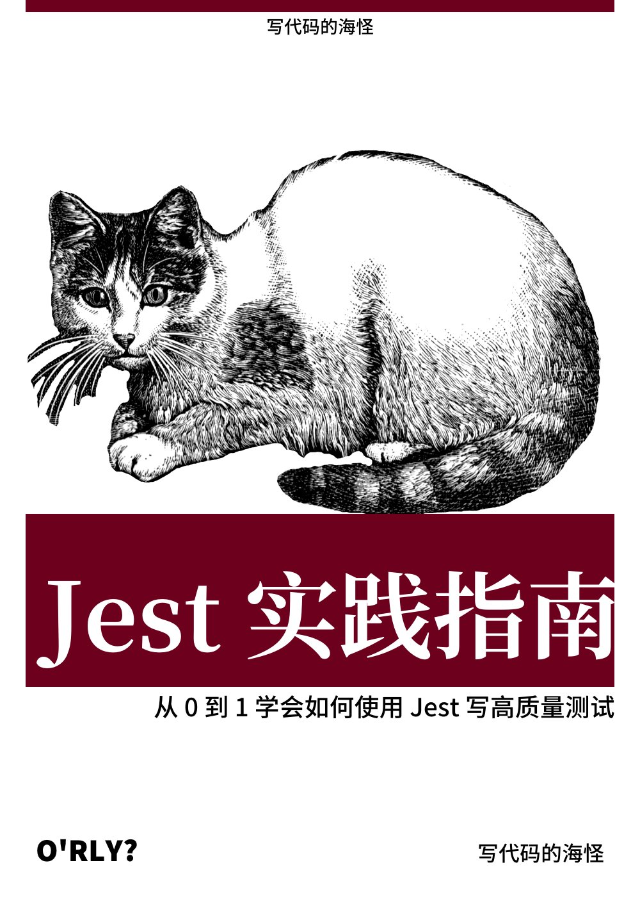
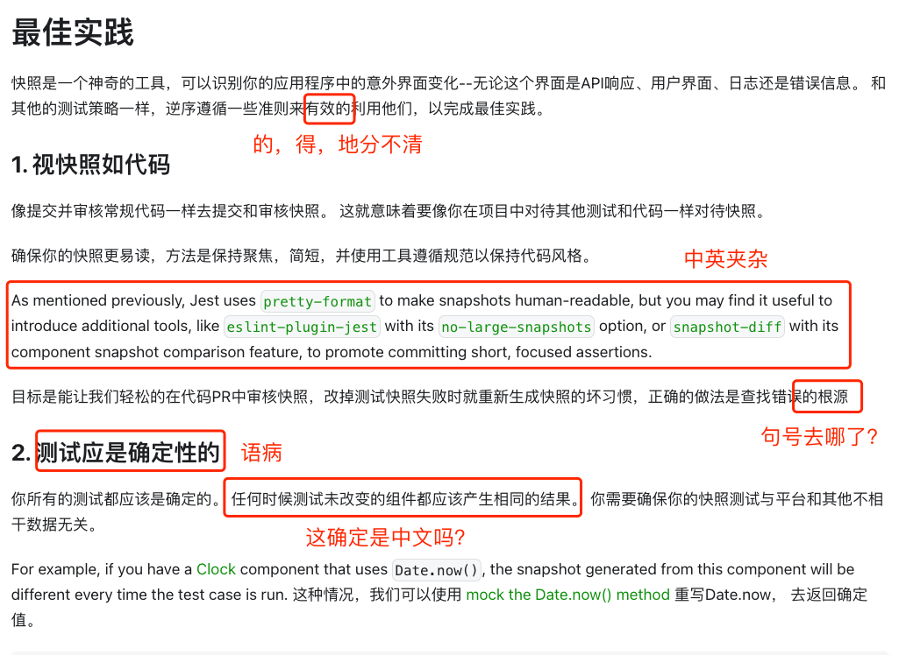
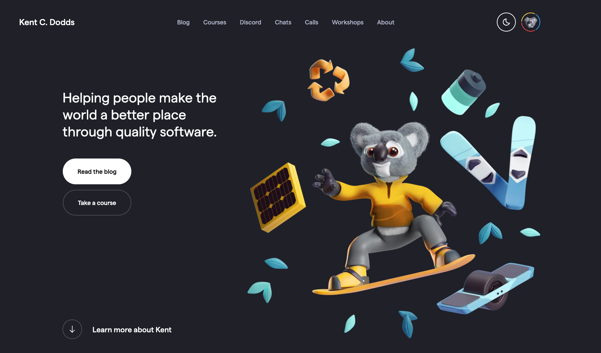

# 🃏《Jest 实践指南》

[](https://coveralls.io/github/haixiangyan/jest-tutorial?branch=main)


[《Jest 实践指南》访问链接](https://github.yanhaixiang.com/jest-tutorial/)



## 前言

[Jest](https://jestjs.io/) 看似很简单，就像很多博客写的那样：

```js
expect(sum(1, 1)).toEqual(2)
```

然而在真实业务中，写出一个好测试的难度并没有大家想的那么低。我总结了一下写测试的几个难点：

**不会配置。** Jest 的上手文档非常简单，甚至不需要配置。但真实情况是只要一个配置没配好，所有测试都跑不起来。测试不像开发，代码有问题可以慢慢调。
测试是一个 0 - 1 游戏，不是成功就是失败，挫败感非常强。

**不知道要怎么 Mock。** 这个绝对是经典中的经典。虽然官方文档有教程，但是真实的业务往往不是那么理想，远比文档要复杂的多。

**不会构造测试用例。** 刚接触测试时，很容易把做业务那套 “实现 XXX 功能” 的想法代入测试。但测试的重点不在于实现功能，而是构造用例。

**没有测试策略。** 上面是 “技” 的难点，测试还有 “术” 的难点。闷着头一通肝测试代码并不高效，使用合适的测试策略远比写 10 个测试用例重要。

上面这些问题很容易让人写出难以维护和复杂的测试。只要业务一改，不仅要维护业务代码还要维护测试代码。
这时，你不禁感叹：“测试真浪费时间”，最终放弃写测试，直接开摆。

**好的测试会让你获得很高的代码信心，而不好的测试则会严重拖垮项目开发。所以，大家所厌恶的不应该是测试本身，而是那些维护性差的测试。**

## 目的

我在网上翻找关于前端测试的资料时，我发现真的太少了，几乎可以分为几类：

1. **入门类。** 安装 Jest，外加 `expect(1 + 1).toEqual(2)` 小例子
2. **API 说明书类。** 类似于把 Jest 官网抄了一遍
3. **理论类。** 是什么、为什么、测试分类等，但最重要的 “怎么做” 没有说

并不是说这些文章不好，只是，这些文章大多数停留在最初级，很不利于其它同学来学习一门新技术。

同时，我还拜访了一下 [Jest 的官网](https://jestjs.io/zh-Hans/) 。没想到，都 2022 年了，中文翻译依然这么难看：



先不说翻译的正确性如何，单看这中文的内容就让人没有想看下去的欲望，真希望 Jest 能找稍微专业一点的人来做翻译。
由于官网的中文翻译做的实在太烂，遇到问题几乎在中文社区是找不到的。

终于，我看到了 React Testing Library 作者 Kent C. Dodds 的 [博客](https://kentcdodds.com/) 。



他写了很多关于测试思路的文章，每一篇都非常精彩。**受他的启发，我觉得有必要把这些思想和技巧分享出来，最终形成了这本小书。**


## 内容

> 此次教程主要分享测试的思路为主，虽然以 React 为主要技术栈，但使用其它技术栈的读者依然可以流畅阅读。

**本教程是我结合了自身实践、Kent C. Dodds 文章、StackOverflow、Github Issue 以及别的博客最终总结出来的一套实践指南。**

小书包含 3 部分：

**基础实践。** 从 0 到 1 写项目和测试，每一章会通过一个业务例子来分享测试难点、解法和思路。

**[配套项目](https://github.com/haixiangyan/jest-tutorial-example)。** 如果你在某一步卡壳了，也可以参考这个项目。

**测试思路。** 分享一些 Kent 的文章（中文翻译）以及测试总结。

## 求关注

**这教程 + 配套项目写了 3 周，说实话挺累的。原创不易，打赏就不必了，观众老爷省着吧。只求大家多关注一下我的新公众号【写代码的海怪】。**


