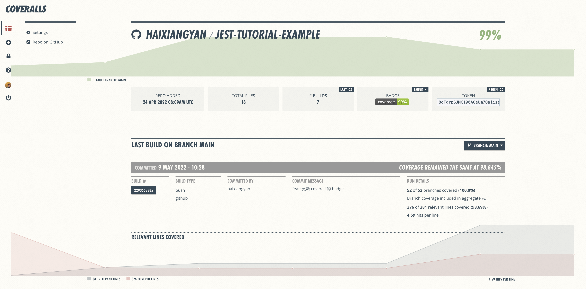

# 自动化测试

每次手动 `npm run test` 跑测试是很痛苦的。通常我们会把执行测试这一步放到流水线中，这也是前端工程化非常重要的一步，称为 **“自动化测试”**。

正好我们可以使用 Github 推出的流水线工具—— [Github Actions](https://github.com/features/actions) 。这一章，就带大家一起配置一下吧。

## Github Actions

在根目录添加 `.github/workflows/node.js.yml`：

```yml
# .github/workflows/node.js.yml
name: Node.js CI

on:
  push:
    branches: [ main ]
  pull_request:
    branches: [ main ]

jobs:
  build:

    runs-on: ubuntu-latest

    strategy:
      matrix:
        node-version: [16.x]

    steps:
    - uses: actions/checkout@v3
    - name: Use Node.js ${{ matrix.node-version }}
      uses: actions/setup-node@v3
      with:
        node-version: ${{ matrix.node-version }}
    - run: npm install
    - run: npm test
```

这里 `on` 会监听 `main` 分支的 `git push` 和 PR 提交两个操作。 **开发者在 `main` 分支推代码或者 PR 合并都会执行下面配置的 `jobs`。**
下面的 `jobs` 也很好理解，就是执行一些 `bash` 脚本。

现在把代码推到 `main`，会发现 Github Actions 开始执行，并成功。

## Coveralls

还记得刚开始时我们配置的 Jest 测试覆盖率么？如果流水线每次跑完都生成一份可视化的测试报告就完美了，不仅能做预警，还能实时了解整体测试覆盖情况。

比较著名的测试平台有 [Coveralls](https://coveralls.io/)，它能够读取 Jest 生成的 `lcov.info` 覆盖率文件，并以可视化的方法展示出来：



首先在 [Coveralls 官网](https://coveralls.io/sign-in) 用 Github 账号登入：


接下来，添加你的 Github 项目：


添加完项目并没有结束，如果你使用 [Travis CI](https://travis-ci.org/) ，可能要手动写命令把 `lcov.info` 传给 [Coveralls](https://coveralls.io) 。而 Github Actions 里有 Coveralls 组件，使用它就能自动完成：

```yaml
name: Node.js CI

on:
  push:
    branches: [ main ]
  pull_request:
    branches: [ main ]

jobs:
  build:

    runs-on: ubuntu-latest

    strategy:
      matrix:
        node-version: [16.x]
        # See supported Node.js release schedule at https://nodejs.org/en/about/releases/

    steps:
    - uses: actions/checkout@v3
    - name: Use Node.js ${{ matrix.node-version }}
      uses: actions/setup-node@v3
      with:
        node-version: ${{ matrix.node-version }}
    - run: npm install
    - run: npm test
    
    - name: Coveralls
      uses: coverallsapp/github-action@master
      with:
        github-token: ${{ secrets.GITHUB_TOKEN }}
```

再次把代码推到 `main` 分支，等上一会，就可以在 [Coveralls 项目列表页](https://coveralls.io/repos) 看到你的测试覆盖率情况了。

一旦把测试报告推到 Coveralls，你就可以在项目详情页里找到这个 Badge：


点击 `embed` 可以看到有多种嵌入方法，一般会把这个 Badge 放到 `README.md`，让项目看起来更有逼格：

[](https://coveralls.io/github/haixiangyan/jest-tutorial-example?branch=main)

## 总结

这一章我们学会了如何配置 Github Actions，在每次推代码和合并 PR 时自动跑测试，并通过 `coverallsapp/github-action@master` 组件把测试覆盖率报告发送给 [Coveralls](https://coveralls.io)，将测试情况可视化。
