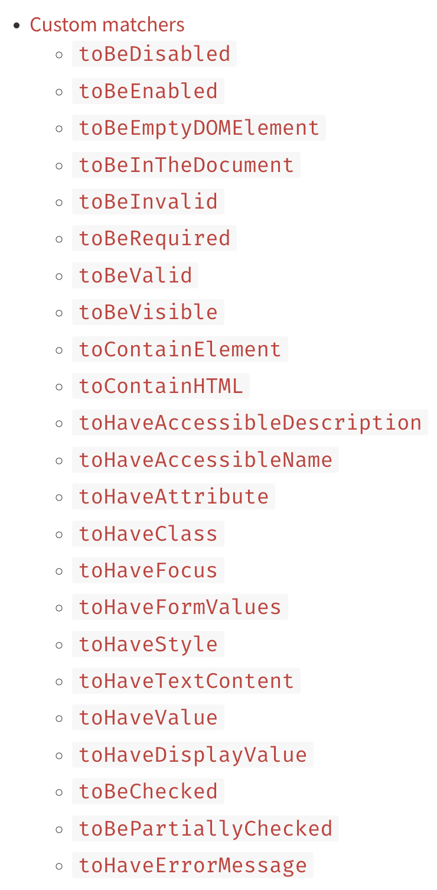

# 组件测试

终于到正片了，这一章我们来讲讲组件测试中的一些技巧和策略吧。

*（PS：这一章内容会稍微有点多，可分上下两部分阅读哦~）*

## 需求

首先，我们还是以一个需求来开始这一章：**实现一个 `AuthButton`，通过 `getLoginState` 获取当前用户的身份并在按钮中展示用户身份。**

简单分析一下这个需求：

1. 实现 `AuthButton`
2. 在 `getLoginState` 发请求获取用户身份
3. 把 `loginStateResponse` 的身份展示到按钮上

因为要发请求，所以我们来安装一下 `axios`：

```shell
npm i axios@0.26.1
```

然后添加 `src/apis/users.ts`，里面写获取用户角色身份的请求：

```ts
import axios from "axios";

// 用户角色身份
export type UserRoleType = "user" | "admin";

// 返回
export interface GetUserRoleRes {
  userType: UserRoleType;
}

// 获取用户角色身份
export const getUserRole = async () => {
  return axios.get<GetUserRoleRes>("https://mysite.com/api/role");
};
```

然后添加 `src/components/AuthButton/index.tsx`：

```tsx
// src/components/AuthButton/index.tsx
import React, { FC, useEffect, useState } from "react";
import { Button, ButtonProps, message } from "antd";
import classNames from "classnames";
import styles from "./styles.module.less";
import { getUserRole, UserRoleType } from "apis/user";

type Props = ButtonProps;

const mapper: Record<UserRoleType, string> = {
  user: "普通用户",
  admin: "管理员",
};

const AuthButton: FC<Props> = (props) => {
  const { children, className, ...restProps } = props;

  const [userType, setUserType] = useState<UserRoleType>();

  const getLoginState = async () => {
    const res = await getUserRole();
    setUserType(res.data.userType);
  };

  useEffect(() => {
    getLoginState().catch((e) => message.error(e.message));
  }, []);

  return (
    <Button {...restProps} className={classNames(className, styles.authButton)}>
      {mapper[userType!] || ""}
      {children}
    </Button>
  );
};

export default AuthButton;
```

这里我们想搞点花里胡哨，引入了 `styles.less`，添加 `src/components/AuthButton/styles.less`：

```less
// src/components/AuthButton/styles.less
.authButton {
  border: 1px solid red;
}
```

最后在 `App.tsx` 里使用一下：

```tsx
// src/App.tsx
const App = () => {
  return (
    <div>
      <section>
        <AuthButton>登录</AuthButton>
      </section>
    </div>
  )
}
```

## Less 的引入问题

好，现在我们一个一个问题来看。写完这样的代码后，TS 首先受不了报错：


我们需要在全局类型声明文件 `src/types/global.d.ts` 里添加 `.less` 文件的类型定义：

```ts
// src/types/global.d.ts
declare module "*.less" {
  const content: any;
  export default content;
}
```

相信 `AuthButton` 大家都能看懂，就不展示页面的情况了，下面主要讨论测试用例的问题。
创建一个用例 `tests/components/AuthButton/simple.test.tsx`：

```tsx
// tests/components/simple.test.tsx
import { render, screen } from "@testing-library/react";
import AuthButton from "components/AuthButton";
import React from "react";

describe('AuthButton', () => {
  it('可以正常展示', () => {
    render(<AuthButton>登录</AuthButton>)

    expect(screen.getByText('登录')).toBeDefined();
  });
})
```

执行一下，直接报错：


在我们前面的章节说了 `jest` 不会转译任何内容，的以这里我们一直用 `tsc` 来转译 TypeScript，而现在我们这里引入了 `.less` 文件，
`tsc` 也看不懂 `.less` 所以导致了 `Unexpected Token`。相信有的同学说：刚刚配置 React 时，不是有一个 `webpack.config.js` 配置了 `less-loader` 了么？
为什么还是会报错？

**很简单，`jest` 只是 Test Runner，只负责跑测试，`tsc` 只负责转译 `.ts` 文件，`webpack` 则脚手架，跑项目的工具，所以这三者本身不存在任何交集。**
只不过，中间 `ts-jest` 这个库把 `jest` 和 `tsc` 联系在了一起而已。所以无论你的 `webpack` 配得怎么天花乱坠，`jest` 根本不看。

那问题要怎么解决呢？**比较推荐的方法是把 `.less` 转译成空文件。** 这在 StackOverflow 上有很多例子：


我们不仅要对 `.less` 文件进行这样的假文件转译，还要对非 JS 静态资源做转译，比如 `jpg`, `svg`, `png` 等等。这里推荐使用 [jest-transform-stub](https://www.npmjs.com/package/jest-transform-stub) 这个库：

```shell
npm i -D jest-transform-stub@2.0.0
```

然后在 `jest.config.js` 里添加转译配置：

```js
// jest.config.js
module.exports = {
  // ...
  transform: {
    ".+\\.(css|styl|less|sass|scss|png|jpg|ttf|woff|woff2)$": "jest-transform-stub"
  } 
}
```

现在再来跑测试就会发现通过了。

## 更多 Matchers

不知道你会不会觉得 `expect(screen.getByText('登录')).toBeDefined();` 有点不靠谱啊。假如 `getByText` 返回的是一个 `null`，这样一来就算找不到元素依然会测试通过。
实际上，我们更希望的断言是：判断带有"登录"的元素是否渲染出来，而不是看拿到的元素是否为 `undefined` 或者 `null`。

[@testing-library/jest-dom](https://www.npmjs.com/package/@testing-library/jest-dom) 这个库提供了很多的 Matcher API：



下面我们安装一下：

```shell
npm i -D @testing-library/jest-dom@5.16.4
```

然后在 `tests/jest-setup.ts` 里引入一下：

```ts
// tests/jest-setup.ts
import '@testing-library/jest-dom'
// ...
```

同时，要在 `tsconfig.json` 里引入这个库的类型声明：

```json
{
  "compilerOptions": {
    "types": ["node", "jest", "@testing-library/jest-dom"]
  }
}
```

然后我们的用例就可以写成这样了：

```tsx
describe('AuthButton', () => {
  it('可以正常展示', () => {
    render(<AuthButton>登录</AuthButton>)

    expect(screen.getByText('登录')).toBeInTheDocument();
  });
})
```

这样我们就不用担心 `getByText` 返回值了。

## 三种 Mock 思路

上面只是让我们跑通 `jest` 的组件测试，现在我们来测这个组件的功能。

相信大家看过不少教 `jest` Mock 的文章，很多文章用的第一个例子就是 Mock `axios`，我们这里也来试试看，添加 `tests/components/AuthButton/mockAxios.test.tsx`：

```tsx
// tests/components/AuthButton/mockAxios.test.tsx
import React from "react";
import axios from "axios";
import { render, screen } from "@testing-library/react";
import AuthButton from "components/AuthButton";

// 更偏向细节，效果并不好
describe("AuthButton Mock Axios", () => {
  it("可以正确展示普通用户按钮内容", async () => {
    jest.spyOn(axios, "get").mockResolvedValueOnce({
      // 其它的实现...
      data: { userType: "user" },
    });

    render(<AuthButton>你好</AuthButton>);

    expect(await screen.findByText("普通用户你好")).toBeInTheDocument();
  });

  it("可以正确展示管理员按钮内容", async () => {
    jest.spyOn(axios, "get").mockResolvedValueOnce({
      // 其它的实现...
      data: { userType: "admin" },
    });

    render(<AuthButton>你好</AuthButton>);

    expect(await screen.findByText("管理员你好")).toBeInTheDocument();
  });
});
```

上面我们把 `axios` 的 `get` 函数给 Mock 了，在两个用例中，一个 Mock 返回 `user`，另一个 Mock 返回 `admin`。这样这么确实能让测试通过，但只有这种方法么？No！
我们还能把 `apis/user.ts` 里的 `getUserRole` 给 Mock 了，一样能达到相同的效果：

```tsx
// tests/components/AuthButton/mockGetUserRole.test.tsx
import React from "react";
import { render, screen } from "@testing-library/react";
import AuthButton from "components/AuthButton";
// 注意：这里要写成 * as userUtils！！！
import * as userUtils from "apis/user";
import { AxiosResponse } from "axios";

// 也很偏向细节，效果也不好
describe("AuthButton Mock Axios", () => {
  it("可以正确展示普通用户按钮内容", async () => {
    jest.spyOn(userUtils, "getUserRole").mockResolvedValueOnce({
      // 其它的实现...
      data: { userType: "user" },
    } as AxiosResponse);

    render(<AuthButton>你好</AuthButton>);

    expect(await screen.findByText("普通用户你好")).toBeInTheDocument();
  });

  it("可以正确展示管理员按钮内容", async () => {
    jest.spyOn(userUtils, "getUserRole").mockResolvedValueOnce({
      // 其它的实现...
      data: { userType: "admin" },
    } as AxiosResponse);

    render(<AuthButton>你好</AuthButton>);

    expect(await screen.findByText("管理员你好")).toBeInTheDocument();
  });
});
```

那还有没有别的方法呢？当然有！我们可以不 Mock 任何函数实现，我们只对 Http 请求进行 Mock！先安装 [msw](https://github.com/mswjs/msw) ，
这个库可以拦截所有 Http 请求，有点类似 [Mock.js](http://mockjs.com/) ，是做测试时一个非常强大好用的 Mock 工具。

我们先在 `tests/mockServer/handlers.ts` 里添加 Http 请求的 Mock Handler：

```ts
import { rest } from "msw";

const handlers = [
  rest.get("https://mysite.com/api/role", async (req, res, ctx) => {
    res(
      ctx.status(200),
      ctx.json({
        userType: "user",
      })
    );
  }),
];

export default handlers;
```

然后在 `tests/mockServer/server.ts` 里使用这些 `handlers` 来创建 Mock Server 并导出它：

```ts
import { setupServer } from "msw/node";
import handlers from "./handlers";

const server = setupServer(...handlers);

export default server;
```

最后，在我们的 `tests/jest-setup.ts` 里使用 Mock Server：

```ts
import server from "./mockServer/server";

beforeAll(() => {
  server.listen();
});

afterEach(() => {
  server.resetHandlers();
});

afterAll(() => {
  server.close();
});

// Mock console.xxx
jest.spyOn(console, "log").mockImplementation();
jest.spyOn(console, "warn").mockImplementation();
jest.spyOn(console, "error").mockImplementation();
```

这样一来，在所有测试用例中都能 Mock `handlers.ts` 里的 Http 请求了。而如果你想在某个测试文件中写它独特的 Mock Handler，
可以使用 `server.use(mockHandler)` 来实现：

```tsx
// tests/components/AuthButton/mockHttp.test.tsx
// 更偏向真实用例，效果更好
import server from "../../mockServer/server";
import { rest } from "msw";
import { render, screen } from "@testing-library/react";
import AuthButton from "components/AuthButton";
import React from "react";
import { UserRoleType } from "apis/user";

// 初始化函数
const setup = (userType: UserRoleType) => {
  server.use(
    rest.get("https://mysite.com/api/role", async (req, res, ctx) => {
      return res(ctx.status(200), ctx.json({ userType }));
    })
  );
};

describe("AuthButton Mock Http 请求", () => {
  it("可以正确展示普通用户按钮内容", async () => {
    setup("user");

    render(<AuthButton>你好</AuthButton>);

    expect(await screen.findByText("普通用户你好")).toBeInTheDocument();
  });

  it("可以正确展示管理员按钮内容", async () => {
    setup("admin");

    render(<AuthButton>你好</AuthButton>);

    expect(await screen.findByText("管理员你好")).toBeInTheDocument();
  });
});
```

## 如何取舍

现在我们一共有 3 种 Mock 策略：Mock `axios`、Mock API 实现、Mock Http 请求。到底如何选择呢？看到这，你可以停下来思考一两分钟，
看看你的答案是否和我说的是否有出入。

在说出我的选择前，我们不妨想想我们做测试的初衷是什么。是因为我让你测试才测试？还是因为你要完成那可怜的 100% 覆盖率？再或者因为没有测试显得你的项目很 Low？都不是！
**后端测试也好、前端测试也好，无论你要测什么，测试的目的都是为了让你能对测过的代码充满信心。**

你可以通过作弊的手法骗过覆盖率，可以通过写一些无聊没有意义的用例骗过你的老板，也可以干脆去掉测试环节，让大家直接在 `master` 上推代码。即使你能骗过所有人，
你依然无法骗自己 —— 在重构和代码改造时，你仍然不信任你的测试和以前的代码。所以，**什么样的测试才能提高代码自信呢？很简单：像真实用户那样去测你的代码。**

用户一共分为两种：
1. **普通用户。** 也即使用网页的人
2. **开发者。** 接口使用者、数据消费者、API 调用侠

刚接触测试的人很容易犯的一个错误就是：**过度测试代码细节！** 虽然我们总说前端单测，单测不就是白盒么？白盒就是要关注代码细节呀。但是很多时候，特别是在测业务相关逻辑的时候，
**过度关注代码细节无形中会创造第三种用户：测试用户。** 也即，只有测试用户才会像你测试用例那样使用。

我们回到刚刚的例子，可以看出来 Mock `axios` 和 Mock `getUserRole` 都融入很多代码细节，无论对于使用 `AuthButton` 组件的开发者以及和 `AuthButton` 交互的用户，
都不应该关注组件里到底用的是哪个接口和调用了哪个函数，这太细节了！这就产生了测试用户，因为只有测试用户才会用假的 `axios` 和 `getUserRole` 实现。

对于上面两类用户来说，他们感知到的就是管理员和普通用户两个 case，最接近这种感知的就是 Http 请求的 Mock，所以，**在这个例子中，对 Http 请求 Mock 会更合理一些。**

测试实现细节还有很多缺点，假如把 `getUserRole` Mock 这个方法中，如果有人把 `getUserRole` 重命名成 `getUserRoleById`，那么你的测试直接就挂了。
对于不熟悉 `AuthButton` 实现的人来说，要找到测试失败的源头是比较麻烦的。

## 如何避免测试用户

实际上这里并不是说真的完全不测代码细节，对于一些工具纯函数是需要深入测好每个 case 的。这里的的意思是要避免产生测试用户，一旦你的测试面向测试用户编写，
那么你的测试会变得非常冗余，而且非常难维护，每次重构都要改测试，这也是为什么大家特别讨厌测试的原因。并不是测试影响了你的效率，而是那些差劲的测试用例拖累了你。

所以要怎么才能避免测试用户呢？拿到要测的业务代码后，我们要去分析：

1. 这段代码的真实用户是谁？开发者还是普通用户？谁会从中获得？
2. 确定了用户后，用测试用例模拟一个相对真实的使用场景
3. 接下来思考这个场景中有哪些东西要 Mock 的，全给干掉！

带着上面的方法回过头来看 `AuthButton` 这个例子：

1. 这个组件的真实用户更偏向普通用户（个人觉得）
2. 使用场景是什么：`<AuthButton>登录</AuthButton>`
3. 要把 Http 请求 Mock 掉

当然，也有可能你会觉得这里用户应该是开发者才对，然后使用场景依然是 `<AuthButton>登录</AuthButton>`，最终选择把 `getUserRole` Mock 掉。
这样做也没问题，因为 `AuthButton` 实在太简单了，简单到就算不用做上面三步也能实现一个测试用例。

不过在真实业务场景里，我们一般喜欢用 `antd` 或者 `element-ui` 来封装业务组件，对于这些组件我们实际更关注的是他们的交互逻辑，而不是实现逻辑，
因此业务组件更多会面向普通开发者。如果你依然不同意我的说法也是 OK 的，因为编程本来没有标准答案，做测试则比开发更为宽松，如果你觉得测试代码细节能带给你更强的代码自信，
那就不要被这些条条框框束缚住，放手去写吧！

## 总结

这一章里，我们学到了：

* 对 `.less` 等静态资源文件的 Mock，可以用 [jest-transform-stub](https://www.npmjs.com/package/jest-transform-stub) 这转译这些文件
* 可以用 `jest.spyOn` 来 Mock 对象中的函数
* 在做测试策略的选择时，我们要避免产生测试用户，要面向开发者和普通用户来模拟测试用例
