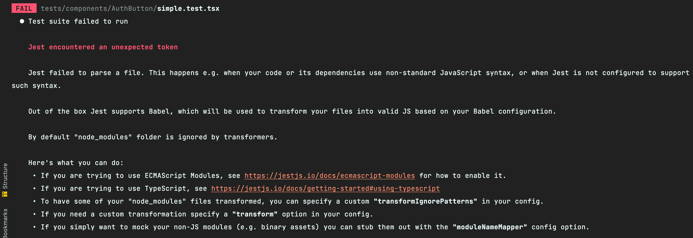

# 组件测试

终于到正片了，这一章我们来讲讲组件测试中的一些技巧和策略吧。

## 需求

首先，我们还是以一个需求来开始这一章：**实现一个 `AuthButton`，通过 `getLoginState` 获取当前用户的身份并在按钮中展示用户身份。**

简单分析一下这个需求：

1. 实现 `AuthButton` 业务组件
2. 在 API 函数 `getLoginState` 发请求获取用户身份
3. 把 Http 请求的返回 `loginStateResponse` 展示到按钮上

我们先来安装一下 `axios`：

```shell
npm i axios@0.26.1
```

然后添加 `src/apis/user.ts`，里面写发送获取用户角色身份的 Http 请求：

```ts
import axios from "axios";

// 用户角色身份
export type UserRoleType = "user" | "admin";

// 返回
export interface GetUserRoleRes {
  userType: UserRoleType;
}

// 获取用户角色身份
export const getUserRole = async () => {
  return axios.get<GetUserRoleRes>("https://mysite.com/api/role");
};
```

添加业务组件 `src/components/AuthButton/index.tsx`：

```tsx
// src/components/AuthButton/index.tsx
import React, { FC, useEffect, useState } from "react";
import { Button, ButtonProps, message } from "antd";
import classnames from "classnames";
import styles from "./styles.module.less";
import { getUserRole, UserRoleType } from "apis/user";

type Props = ButtonProps;

// 身份文案 Mapper
const mapper: Record<UserRoleType, string> = {
  user: "普通用户",
  admin: "管理员",
};

const AuthButton: FC<Props> = (props) => {
  const { children, className, ...restProps } = props;

  const [userType, setUserType] = useState<UserRoleType>();

  // 获取用户身份并设置
  const getLoginState = async () => {
    const res = await getUserRole();
    setUserType(res.data.userType);
  };

  useEffect(() => {
    getLoginState().catch((e) => message.error(e.message));
  }, []);

  return (
    <Button {...restProps} className={classnames(className, styles.authButton)}>
      {mapper[userType!] || ""}
      {children}
    </Button>
  );
};

export default AuthButton;
```

这里我们还不忘搞点花里胡哨，引入了 `src/components/AuthButton/styles.module.less`：

```less
// src/components/AuthButton/styles.module.less
.authButton {
  border: 1px solid red;
}
```

最后在 `App.tsx` 里使用一下：

```tsx
// src/App.tsx
const App = () => {
  return (
    <div>
      <section>
        <AuthButton>登录</AuthButton>
      </section>
    </div>
  )
}
```

## Less 的引入问题

好，现在我们一个一个问题来看。写完上面的代码后，TS 首先受不了报错：


我们需要在全局类型声明文件 `src/types/global.d.ts` 里添加 `.less` 文件的类型定义：

```ts
// src/types/global.d.ts
declare module "*.less" {
  const content: any;
  export default content;
}
```

相信大家都能看懂 `AuthButton` 的代码，就不展示页面的情况了，下面主要来讨论测试用例的问题。
创建一个用例 `tests/components/AuthButton/simple.test.tsx`：

```tsx
// tests/components/AuthButton/simple.test.tsx
import { render, screen } from "@testing-library/react";
import AuthButton from "components/AuthButton";
import React from "react";

describe('AuthButton', () => {
  it('可以正常展示', () => {
    render(<AuthButton>登录</AuthButton>)

    expect(screen.getByText('登录')).toBeDefined();
  });
})
```

执行一下，直接报错：



前面的章节说了 **Jest 不会转译任何内容**，因此我们一直用 `tsc` 来转译 TypeScript。**由于 `tsc` 看不懂引入的 `.less`，导致了 `Unexpected Token` 报错。** 

相信有的同学说：*刚刚配置 React 时，不是有一个 `webpack.config.js` 配置了 `less-loader` 了么？为什么还是会报错？*

**很简单，Jest 只是 Test Runner，只负责跑测试，`tsc` 负责转译 `.ts` 文件，`webpack` 则作为脚手架用于跑项目的工具，所以这三者本身不存在任何交集。**
只不过，中间 `ts-jest` 把 `jest` 和 `tsc` 联系起来，`ts-loader` 则把 `webpack` 和 `tsc` 联系在了一起。所以无论你的 Webpack 配得怎么天花乱坠，Jest 根本不看。

那问题要怎么解决呢？**比较推荐的方法是把 `.less` 转译成空文件。** 这在 [StackOverflow 上有很多例子](https://stackoverflow.com/questions/54627028/jest-unexpected-token-when-importing-css) ：


除了 `.less` 文件，我们还要对非 JS 静态资源做转译，比如 `jpg`, `svg`, `png` 等等（这些不会影响测试）。
这里推荐使用 [jest-transform-stub](https://www.npmjs.com/package/jest-transform-stub) 这个库：

```shell
npm i -D jest-transform-stub@2.0.0
```

然后在 `jest.config.js` 里添加转译配置：

```js
// jest.config.js
module.exports = {
  // ...
  transform: {
    ".+\\.(css|styl|less|sass|scss|png|jpg|ttf|woff|woff2)$": "jest-transform-stub"
  } 
}
```

现在再来跑测试就会发现测试通过。

## 更多 Matchers

不知道你会不会觉得 `expect(screen.getByText('登录')).toBeDefined();` 有点不靠谱啊。假如 `getByText` 返回的是一个 `null`，这样一来就算找不到元素依然会测试通过。
实际上，我们更希望的断言是：判断带有 “登录” 的元素是否渲染出来，而不是看拿到的元素是否为 `undefined` 或者 `null`。

**这种要判断 XXX 的东西，我们称之为 Matcher（中文翻译为匹配器，个人觉得翻译很烂，记住 Matcher 就好）**。
正好 [@testing-library/jest-dom](https://www.npmjs.com/package/@testing-library/jest-dom) 这个库提供了很多关于 DOM 的 Matcher API：

* toBeDisabled
* toBeEnabled
* toBeEmptyDOMElement
* toBeInTheDocument
* toBeInvalid
* toBeRequired
* toBeValid
* toBeVisible
* toContainElement
* toContainHTML
* toHaveAccessibleDescription
* toHaveAccessibleName
* toHaveAttribute
* toHaveClass
* toHaveFocus
* toHaveFormValues
* toHaveStyle
* toHaveTextContent
* toHaveValue
* toHaveDisplayValue
* toBeChecked
* toBePartiallyChecked
* toHaveErrorMessage

下面我们安装一下：

```shell
npm i -D @testing-library/jest-dom@5.16.4
```

然后在 `tests/jest-setup.ts` 里引入一下：

```ts
// tests/jest-setup.ts
import '@testing-library/jest-dom'
// ...
```

同时，要在 `tsconfig.json` 里引入这个库的类型声明：

```json
{
  "compilerOptions": {
    "types": ["node", "jest", "@testing-library/jest-dom"]
  }
}
```

然后我们的用例就可以写成这样了：

```tsx
describe('AuthButton', () => {
  it('可以正常展示', () => {
    render(<AuthButton>登录</AuthButton>)

    expect(screen.getByText('登录')).toBeInTheDocument();
  });
})
```

这样一来，我们就不用担心 `getByText` 返回值了。

::: warning
如果你的项目报了 `Entry point of type library '@testing-library/jest-dom' specified in compilerOptions` 这个错误，
可以按照 [这个 Issue](https://github.com/haixiangyan/jest-tutorial/issues/26) 来修复。
:::

## 三种 Mock 思路

上面只是一个 Demo 测试，现在我们来测这个组件的功能。

### Mock Axios

相信大家看过不少教 Jest Mock 的文章，它们经常用的第一个例子就是 Mock `axios`。这里也用了 `axios` 发请求，我们可以来 Mock 一下。
添加 `tests/components/AuthButton/mockAxios.test.tsx`：

```tsx
// tests/components/AuthButton/mockAxios.test.tsx
import React from "react";
import axios from "axios";
import { render, screen } from "@testing-library/react";
import AuthButton from "components/AuthButton";

// 更偏向细节，效果并不好
describe("AuthButton Mock Axios", () => {
  it("可以正确展示普通用户按钮内容", async () => {
    jest.spyOn(axios, "get").mockResolvedValueOnce({
      // 其它的实现...
      data: { userType: "user" },
    });

    render(<AuthButton>你好</AuthButton>);

    expect(await screen.findByText("普通用户你好")).toBeInTheDocument();
  });

  it("可以正确展示管理员按钮内容", async () => {
    jest.spyOn(axios, "get").mockResolvedValueOnce({
      // 其它的实现...
      data: { userType: "admin" },
    });

    render(<AuthButton>你好</AuthButton>);

    expect(await screen.findByText("管理员你好")).toBeInTheDocument();
  });
});
```

上面我们分别对两个用例的 `axios.get` 进行了 Mock，使得一个 Mock 返回 `user`，另一个 Mock 返回 `admin`。
最后，在这两个用例里分别断言 `<AuthButton/>` 的渲染内容。

Mock `axios` 确实是一个方法，但只有这种方法么？No！

### Mock API 函数

另一种方法是 Mock `apis/user.ts` 里的 `getUserRole` API 函数，一样能达到相同的效果：

```tsx
// tests/components/AuthButton/mockGetUserRole.test.tsx
import React from "react";
import { render, screen } from "@testing-library/react";
import AuthButton from "components/AuthButton";
// 注意：这里要写成 * as userUtils！！！
import * as userUtils from "apis/user";
import { AxiosResponse } from "axios";

// 也很偏向细节，效果也不好
describe("AuthButton Mock Axios", () => {
  it("可以正确展示普通用户按钮内容", async () => {
    jest.spyOn(userUtils, "getUserRole").mockResolvedValueOnce({
      // 其它的实现...
      data: { userType: "user" },
    } as AxiosResponse);

    render(<AuthButton>你好</AuthButton>);

    expect(await screen.findByText("普通用户你好")).toBeInTheDocument();
  });

  it("可以正确展示管理员按钮内容", async () => {
    jest.spyOn(userUtils, "getUserRole").mockResolvedValueOnce({
      // 其它的实现...
      data: { userType: "admin" },
    } as AxiosResponse);

    render(<AuthButton>你好</AuthButton>);

    expect(await screen.findByText("管理员你好")).toBeInTheDocument();
  });
});
```

和第一种方法类似，我们依然监听了某个函数（这里是 `getUserRole`），通过 Mock 其返回来模拟不同场景。

### Mock Http

那还有没有别的方法呢？当然有！我们可以不 Mock 任何函数实现，只对 Http 请求进行 Mock！先安装 [msw](https://github.com/mswjs/msw) ：

::: tip
[msw](https://github.com/mswjs/msw) 可以拦截指定的 Http 请求，有点类似 [Mock.js](http://mockjs.com/) ，是做测试时一个非常强大好用的 Http Mock 工具。
:::

```shell
npm i -D msw@0.39.2
```

先在 `tests/mockServer/handlers.ts` 里添加 Http 请求的 Mock Handler：

```ts
import { rest } from "msw";

const handlers = [
  rest.get("https://mysite.com/api/role", async (req, res, ctx) => {
    return res(
      ctx.status(200),
      ctx.json({
        userType: "user",
      })
    );
  }),
];

export default handlers;
```

然后在 `tests/mockServer/server.ts` 里使用这些 `handlers` 创建 Mock Server 并导出它：

```ts
import { setupServer } from "msw/node";
import handlers from "./handlers";

const server = setupServer(...handlers);

export default server;
```

最后，在我们的 `tests/jest-setup.ts` 里使用 Mock Server：

```ts
import server from "./mockServer/server";

beforeAll(() => {
  server.listen();
});

afterEach(() => {
  server.resetHandlers();
});

afterAll(() => {
  server.close();
});
```

这样一来，在所有测试用例中都能获得 `handlers.ts` 里的 Mock 返回了。**如果你想在某个测试文件中想单独指定某个接口的 Mock 返回，
可以使用 `server.use(mockHandler)` 来实现。** 我们以 `<AuthButton/>` 为例：

```tsx
// tests/components/AuthButton/mockHttp.test.tsx
// 更偏向真实用例，效果更好
import server from "../../mockServer/server";
import { rest } from "msw";
import { render, screen } from "@testing-library/react";
import AuthButton from "components/AuthButton";
import React from "react";
import { UserRoleType } from "apis/user";

// 初始化函数
const setup = (userType: UserRoleType) => {
  server.use(
    rest.get("https://mysite.com/api/role", async (req, res, ctx) => {
      return res(ctx.status(200), ctx.json({ userType }));
    })
  );
};

describe("AuthButton Mock Http 请求", () => {
  it("可以正确展示普通用户按钮内容", async () => {
    setup("user");

    render(<AuthButton>你好</AuthButton>);

    expect(await screen.findByText("普通用户你好")).toBeInTheDocument();
  });

  it("可以正确展示管理员按钮内容", async () => {
    setup("admin");

    render(<AuthButton>你好</AuthButton>);

    expect(await screen.findByText("管理员你好")).toBeInTheDocument();
  });
});
```

这里声明了一个 `setup` 函数，用于在每个用例前初始化 Http 请求的 Mock 返回。通过传不同值给 `setup` 就可以灵活模拟测试场景了。

## 如何取舍

现在我们一共有 3 种 Mock 策略：
1. **Mock `axios`**
2. **Mock API 实现**
3. **Mock Http 请求**
 
到底如何选择呢？你可以停下来思考一两分钟。

在说出我的选择前，我们不妨想想我们做测试的初衷是什么。是因为我让你测试才测试？还是因为你要完成那可怜的 100% 覆盖率？再或者是因为没有测试显得你的项目很 Low？都不是！
**无论后端测试也好、前端测试也好，不管你要测什么，测试的目的都是为了让你能对测过的代码充满信心（Confidence）。**

你可以通过作弊的手法骗过覆盖率，可以通过写一些无聊没有意义的用例骗过你的老板，也可以干脆去掉测试环节，让大家直接在 `master` 上推代码。即使你能骗过所有人，
你依然无法骗自己 —— 在重构和代码改造时，你仍然不信任写过的代码。那么，**什么样的测试才能提高代码自信呢？很简单：像真实用户那样去测你的代码。**

这里说的用户一共分为两种：
1. **普通用户。** 也即使用网页的人
2. **开发者。** 接口使用者、数据消费者、API 调用侠

刚接触测试的人很容易犯的一个错误就是：**过度测试代码细节！** 虽然我们经常讨论前端单测，单测不就是白盒么？白盒就是要关注代码细节呀。但是很多时候，特别是在测业务相关逻辑的时候，
**过度关注代码细节无形中会创造第三种用户：测试用户。** 也即，**只有测试用户才会像你测试用例那样使用你的代码/组件/页面。**

我们回到刚刚的例子，可以看出来 Mock `axios` 和 Mock `getUserRole` 都融入很多代码细节，无论对于使用 `AuthButton` 组件的开发者以及和 `AuthButton` 交互的用户，
都不应该关注组件里到底用的是哪个接口和调用了哪个函数，这太细节了！这就产生了测试用户，因为只有测试用户才会用假的 `axios` 和 `getUserRole` 实现。

对于上面两类用户来说，他们感知到的就是管理员和普通用户两个 case，最能模拟出这种感知的就是第三种 Mock —— Mock Http 请求，所以，**在这个例子中，我觉得对 Http 请求 Mock 更合理一些。**

测试实现细节还有很多缺点，比如，在 Mock `getUserRole` 这个方法中，如果有人把 `getUserRole` 重命名成 `getUserRoleById`，那么你的测试直接就挂了。这就是上一章所说的 **“假错误”**。
对于不熟悉 `AuthButton` 实现的人来说，要找到测试失败的源头是比较麻烦的。

## 如何避免测试用户

当然，上面说的并不是完全不测代码细节。对于一些工具纯函数是需要深入测好每个 `if-else` 的，**这是因为这种场景下 “真实用户” 变成了开发者，
所以当然要深入细节来测，这与刚刚说的观点并不冲突。**

**上文观点主要是希望大家避免产生 “测试用户”。** 一旦你的测试面向 “测试用户” 编写，那么你的测试会变得非常冗余，难以维护。一旦要做重构，所有测试都要跟着改。
这也是为什么大家特别讨厌测试的原因。并不是测试影响了你的效率，而是那些差劲的测试代码拖累了你。

所以要怎么才能避免测试用户呢？拿到要测的业务代码后，我们要去分析：

1. 这段代码的 **真实用户** 是谁？开发者还是普通用户？谁会从中获利？
2. 确定了用户后，用测试用例模拟一个相对 **真实的使用场景**
3. 接下来思考 **为了模拟这个场景**，要做哪些 Mock 操作？

带着上面的方法回过头来看 `AuthButton` 这个例子：

1. 用户是谁：这个组件的真实用户更偏向普通用户（个人觉得）
2. 使用场景是什么：`<AuthButton>登录</AuthButton>`
3. 存在哪些外部依赖：要把 Http 请求 Mock 掉

在真实业务中，开发者一般喜欢用 `antd` 或者 `element-ui` 来封装业务组件，对于这些组件我们实际更关注的是交互逻辑，而不是实现逻辑。

当然，也有可能你会觉得这里的 “用户” 是开发者，最终选择把 `getUserRole` Mock 掉。这样做也没问题，**因为测试本来就是一个取舍的过程，不像写业务有一个绝对准确的结果。**
只要你觉得这么测能带给你更强的代码信心，那就放手去写吧！

## 总结

这一章里，我们学到了：

* 可以用 [jest-transform-stub](https://www.npmjs.com/package/jest-transform-stub) 来转译非 JS 静态资源文件
* 可以用 `jest.spyOn` 来 Mock 对象中的函数
* 在做测试策略的选择时，我们要避免产生测试用户，要面向 **开发者** 和 **普通用户** 来写测试用例
