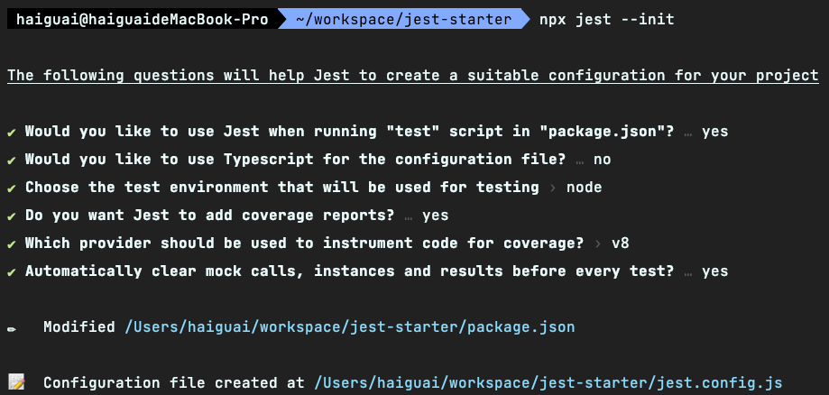
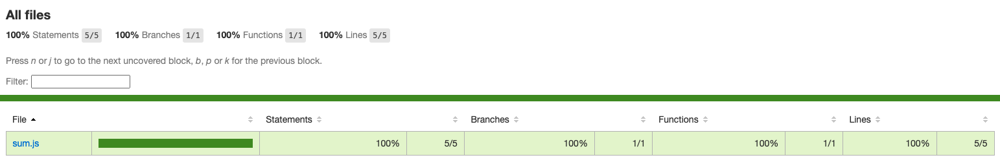

# 起步

首先，我们来创建一个新项目。

::: warning
阅读中遇到卡壳时，可以参考 [配套项目](https://github.com/haixiangyan/jest-tutorial-example) 。
:::

## 创建项目

使用 `npm` 初始化，并安装 `jest`。

```shell
# 创建项目
mkdir jest-starter
cd jest-starter

# 初始化
npm init -y

# 安装依赖
npm i -D jest@27.5.1
```

::: warning
目前 Jest 已经来到 28 版本了，但是我在实践中发现 `Jest@28` 和 `react@18` 以及 `@testing-library/react` 一起使用时会有冲突，建议大家跟着我使用 **稳定** 的版本。
:::

安装 Jest 后，用 `jest-cli` 初始化 `jest` 配置文件：

```shell
npx jest --init
```

初始化配置文件时，Jest 会问你一堆问题，可以先按我下面的图来选择（只打开覆盖率和自动清除 Mock），别的以后再说：



执行完之后，就会看到有一个 `jest.config.js` 的配置文件：

```shell
// jest.config.js
module.exports = {
  // 自动清除 Mock
  clearMocks: true,

  // 开启覆盖率
  collectCoverage: true,

  // 指定生成覆盖率报告文件存放位置
  coverageDirectory: "coverage",

  // 不用管
  coverageProvider: "v8",
};
```

::: tip
建议不要犯了强迫症把 `jest.config.js` 的注释去掉，它们可以作为配置 Jest 的简单版文档。
:::

## 第一个测试

有了基本配置后，添加一个工具函数文件 `src/utils/sum.js` 作为我们第一个业务文件：

```js
// src/utils/sum.js
const sum = (a, b) => {
  return a + b;
}

module.exports = sum;
```

然后，添加我们项目的第一个测试用例 `tests/utils/sum.test.js`：

```js
// tests/utils/sum.test.js
const sum = require("../../src/utils/sum");

describe('sum', () => {
  it('可以做加法', () => {
    expect(sum(1, 1)).toEqual(2);
  });
})
```

项目结构如下：

```
├── jest.config.js
├── package-lock.json
├── package.json
├── src
│   └── utils
│       └── sum.js
└── tests
    └── utils
        └── sum.test.js
```

## 执行测试

一切就绪，执行以下命令启动测试：

```shell
# npx jest
npm run test
```

执行结果如下：


## 单文件测试

考虑如下场景，如果我们只想测试项目中某一个单独的文件。
```shell
# npx jest
npm run test <文件的相对路径>
```

**🎉 成功 🎉**

## 覆盖率报告

上面终端里展示的就是覆盖率情况，只不过以终端的形式展示。现在我们打开根目录下的 `coverage` 目录，会发现生成很多覆盖率文件：

```
├── clover.xml             # Clover XML 格式的覆盖率报告
├── coverage-final.json    # JSON 格式的覆盖率报告
├── lcov-report            # HTML 格式的覆盖率报告
│   ├── base.css
│   ├── block-navigation.js
│   ├── favicon.png
│   ├── index.html         # 覆盖率根文件
│   ├── prettify.css
│   ├── prettify.js
│   ├── sort-arrow-sprite.png
│   ├── sorter.js
│   └── sum.js.html        # sum.js 的覆盖率情况
└── lcov.info
```

Jest 会在 `coverage` 目录下生成各种不同格式的覆盖率报告文件，有 `XML`，`JSON`，也有 `HTML` 的。生成这么多不同格式的测试报告只只是为了方便不同工具的读取，
比如 JS 读 JSON 就比读 XML 容易，它们描述的内容都是一样的。

无论哪种格式，我们都很难直观地看懂。因此，Jest 也支持生成网页的测试报告，打开 `lcov-report/index.html` 就可以看到网页版的测试报告了：



## 总结

这一章里，我们创建了新项目，并成功编写并测试了第一个测试用例。

然而，这只是开始，后面还有很多问题等着我们解决，马上去看下一章吧。
