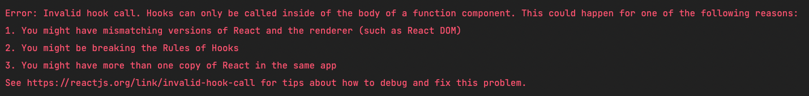

## React Hook 测试

除上一章的 Redux，我们日常写的 React App 还有一个很重要的部分：React Hooks。这一章就来讲霁我们该如何测试这部分的代码。

## useCounter

我们依然从一个需求开始讲起。假如要实现一个 `useCounter` 的 Hook，在 `src/hooks/useCounter.ts` 添加：

```ts
// src/hooks/useCounter.ts
import { useState } from "react";

export interface Options {
  min?: number;
  max?: number;
}

export type ValueParam = number | ((c: number) => number);

function getTargetValue(val: number, options: Options = {}) {
  const { min, max } = options;
  let target = val;
  if (typeof max === "number") {
    target = Math.min(max, target);
  }
  if (typeof min === "number") {
    target = Math.max(min, target);
  }
  return target;
}

function useCounter(initialValue = 0, options: Options = {}) {
  const { min, max } = options;

  const [current, setCurrent] = useState(() => {
    return getTargetValue(initialValue, {
      min,
      max,
    });
  });

  const setValue = (value: ValueParam) => {
    setCurrent((c) => {
      const target = typeof value === "number" ? value : value(c);
      return getTargetValue(target, {
        max,
        min,
      });
    });
  };

  const inc = (delta = 1) => {
    setValue((c) => c + delta);
  };

  const dec = (delta = 1) => {
    setValue((c) => c - delta);
  };

  const set = (value: ValueParam) => {
    setValue(value);
  };

  const reset = () => {
    setValue(initialValue);
  };

  return [
    current,
    {
      inc,
      dec,
      set,
      reset,
    },
  ] as const;
}

export default useCounter;
```

这个 Hook 很简单，就是非常经典的计数器，最后返回了增加、减少、设置和重置 4 个操作。

## 误区

有很多人会认为 `hook` 不就是纯函数么？为什么不能直接像纯函数那样去测呢？

```ts
describe("useCounter", () => {
  it("可以加 1", () => {
    const [counter, utils] = useCounter(0);

    expect(counter).toEqual(0);

    utils.inc(1);

    expect(counter).toEqual(1);
  });
});
```

由于这里用到了 `useState`，而 React 规定只有在组件中才能使用这些 Hooks，所以这样测试的结果就会得到下面的报错：



那我们是否可以通过前面讲的 Mock 手段来处理掉 `useState` 呢？**千万别这么做！一步错步步错。** 如果你的 Hook 里不仅有 `useState`，还有 `useEffect` 这样的呢？
难道你要一个个都要 Mock 一遍么？

想想我们做测试的初衷，我们做测试是为什么？**测试的初衷是为了带我们带来强大的代码信心。**。行行行，我知道你听这句话都听烦了，但我就是要把这句话像思想钢印一样印在你的脑海中。
如果把它忘掉，你会很容易掉入测试实现代码细节的陷阱中。一旦你的关注点不是代码的信心，而是测试代码细节，那么你的测试用例会变得非常脆弱，难以维护。
这样写出来的测试不仅不能给你带来代码信心，还会拖垮开发进程，真的不如不做测试。

不好意思，唠叨了一会，我们回来看看这个例子。要解决测试代码细节这个问题，唯一的办法就是把这个东西看成整体，比如......我们真的写一个组件来做测试？**可以！**

## 测试组件

添加 `tests/hooks/useCounter/TestComponent.test.tsx`：

```tsx
import useCounter from "hooks/useCounter";
import { render, screen } from "@testing-library/react";
import userEvent from "@testing-library/user-event";
import React from "react";

// 测试组件
const UseCounterTest = () => {
  const [counter, { inc, set, dec, reset }] = useCounter(0);
  return (
    <section>
      <div>Counter: {counter}</div>
      <button onClick={() => inc(1)}>inc(1)</button>
      <button onClick={() => dec(1)}>dec(1)</button>
      <button onClick={() => set(10)}>set(10)</button>
      <button onClick={reset}>reset()</button>
    </section>
  );
};

describe("useCounter", () => {
  it("可以做加法", async () => {
    render(<UseCounterTest />);

    const incBtn = screen.getByText("inc(1)");

    await userEvent.click(incBtn);

    expect(screen.getByText("Counter: 1")).toBeInTheDocument();
  });

  it("可以做减法", async () => {
    render(<UseCounterTest />);

    const decBtn = screen.getByText("dec(1)");

    await userEvent.click(decBtn);

    expect(screen.getByText("Counter: -1")).toBeInTheDocument();
  });

  it("可以设置值", async () => {
    render(<UseCounterTest />);

    const setBtn = screen.getByText("set(10)");

    await userEvent.click(setBtn);

    expect(screen.getByText("Counter: 10")).toBeInTheDocument();
  });

  it("可以重置值", async () => {
    render(<UseCounterTest />);

    const incBtn = screen.getByText("inc(1)");
    const resetBtn = screen.getByText("reset()");

    await userEvent.click(incBtn);
    await userEvent.click(resetBtn);

    expect(screen.getByText("Counter: 0")).toBeInTheDocument();
  });
});
```

上面我们直接写了一个 `UseCounterTest` 的组件，然后在里面使用 `useCounter`，通过 `<Button/>` 绑定返回的增加、减少、设置和重置功能。
在每个测试用例中，我们只需要点击一下按钮，然后 `expect` 一下 `Counter：n` 的文本结果就可以完成测试了。

相信看到这种方法的你和我当初一样：这 TM 也行啊？你还真整一个组件来测试？当然，这个方法并不好，因为我们还要用 `<Button/>` 来绑定一些操作，
然后通过点击按钮来触发它们，太 Low 了。为什么不直接操作 `inc`, `dec`, `set` 和 `reset` 这几个函数呢？

## setup

当然可以！我们要做的就是创建一个 `setup` 函数，在里面生成组件，同时把 `useCounter` 的结果返回出来就可以了：

```tsx
// tests/hooks/useCounter/setupTestComponent.test.ts
import useCounter from "hooks/useCounter";
import { act, render } from "@testing-library/react";
import React from "react";

const setup = (initialNumber: number) => {
  const returnVal = {};

  const UseCounterTest = () => {
    const [counter, utils] = useCounter(initialNumber);

    Object.assign(returnVal, {
      counter,
      utils,
    });

    return null;
  };

  render(<UseCounterTest />);

  return returnVal;
};

describe("useCounter", () => {
  it("可以做加法", async () => {
    const useCounterData: any = setup(0);

    act(() => {
      useCounterData.utils.inc(1);
    });

    expect(useCounterData.counter).toEqual(1);
  });

  it("可以做减法", async () => {
    const useCounterData: any = setup(0);

    act(() => {
      useCounterData.utils.dec(1);
    });

    expect(useCounterData.counter).toEqual(-1);
  });

  it("可以设置值", async () => {
    const useCounterData: any = setup(0);

    act(() => {
      useCounterData.utils.set(10);
    });

    expect(useCounterData.counter).toEqual(10);
  });

  it("可以重置值", async () => {
    const useCounterData: any = setup(0);

    act(() => {
      useCounterData.utils.inc(1);
      useCounterData.utils.reset();
    });

    expect(useCounterData.counter).toEqual(0);
  });
});
```

上面 `setup` 函数中，我们在里面定义了一个 `UseCounterTest` 测试组件，然后在里调用了 `useCounter`。和第一种试的不同在于，
我们在 `UseCouterTest` 里把 `useCoutner` 的内容赋值到 `setup` 的返回对象中，最后一次返回。

这就相当于，在第一个方法里，我们要一直利用 `UseCounterTest` 来完成测试，而这个方法则只是借了 `UseCounterTest` 组件环境来生成一下 `useCounter` 结果，
用完就把别人抛弃了，渣男！

这个方法的好处是虽然我们用到了测试组件，但我们只是用了它提供的组件环境，不会被它的内容牵制。这里还要注意一个点，由于调用 `inc` 时，`setState` 是一个异步逻辑，
因此我们要使用 `@testing-library/react` 提供的 `act`，把更新状态的操作放到 `act` 中。

## renderHook

基于这样的想法，`@testing-library/react` 上面的步骤封装成了一个公共函数 `renderHook`。你要做的就是在回调中使用 `useCounter` 就可以了：

```tsx
// tests/hooks/useCounter/renderHook.test.ts
import { renderHook } from "@testing-library/react-hooks";
import useCounter from "hooks/useCounter";
import { act } from "@testing-library/react";

describe("useCounter", () => {
  it("可以做加法", () => {
    const { result } = renderHook(() => useCounter(0));

    act(() => {
      result.current[1].inc(1);
    });

    expect(result.current[0]).toEqual(1);
  });

  it("可以做减法", () => {
    const { result } = renderHook(() => useCounter(0));

    act(() => {
      result.current[1].dec(1);
    });

    expect(result.current[0]).toEqual(-1);
  });

  it("可以设置值", () => {
    const { result } = renderHook(() => useCounter(0));

    act(() => {
      result.current[1].inc(10);
    });

    expect(result.current[0]).toEqual(10);
  });

  it("可以重置值", () => {
    const { result } = renderHook(() => useCounter(0));

    act(() => {
      result.current[1].inc(1);
      result.current[1].reset();
    });

    expect(result.current[0]).toEqual(0);
  });

  it("可以使用最大值", () => {
    const { result } = renderHook(() => useCounter(100, { max: 10 }));

    expect(result.current[0]).toEqual(10);
  });

  it("可以使用最小值", () => {
    const { result } = renderHook(() => useCounter(0, { min: 10 }));

    expect(result.current[0]).toEqual(10);
  });
});
```

可以看到这里的 `renderHook` 都能把 `setup` 完美替换掉了。

## useQuery

实际上 `renderHook` 只是第二种方法 `setupTestComponent` 的高度封装而已，更通用的方法依然是 `setupTestComponent`。

这里我来再举一个更复杂的例子：

```ts
import React from "react";
import { useLocation } from "react-router-dom";

// 获取查询参数
const useQuery = () => {
  const { search } = useLocation();

  return React.useMemo(() => new URLSearchParams(search), [search]);
};

export default useQuery;
```

`useQuery` 是我在 StackOverflow 上看到的一个 Hook。它的作用就是能够获取查询参数的值：

```tsx
// https://mysite.com?id=123
const component = () => {
  const query = useQuery()
  
  return (
    // 123
    <div>{query.get("id")}</div>
  )
}
```

这个例子的难点在于我们的测试组件不能再那么简单了，至少要包含一些 React Router 的内容，否则使用 `useLocation` 时会报错：


所以我们得在测试组件中通过 `createMemoryHistory` 这个 API 来创造 React Router 的环境：

```tsx
import React from "react";
import useQuery from "hooks/useQuery";
import { createMemoryHistory, InitialEntry } from "history";
import { render } from "@testing-library/react";
import { Router } from "react-router-dom";

const setup = (initialEntries: InitialEntry[]) => {
  const history = createMemoryHistory({
    initialEntries,
  });

  const returnVal = {
    query: new URLSearchParams(),
  };

  const TestComponent = () => {
    const query = useQuery();

    Object.assign(returnVal, { query });

    return null;
  };

  // 此处为 react router v6 的写法
  render(
    <Router location={history.location} navigator={history}>
      <TestComponent />
    </Router>
  );
  // 此处为 react router v5 的写法
  // render(
  //   <Router history={history}>
  //     <TestComponent />
  //   </Router>
  // );

  return returnVal;
};

describe("userQuery", () => {
  it("可以获取参数", () => {
    const result = setup([
      {
        pathname: "/home",
        search: "?id=123",
      },
    ]);

    expect(result.query.get("id")).toEqual("123");
  });

  it("查询参数为空时返回 Null", () => {
    const result = setup([
      {
        pathname: "/home",
      },
    ]);

    expect(result.query.get("id")).toBeNull();
  });
});
```

注意，React Route v5 和 v6 两个版本的 `history` 传入方式是不一样的。

## 总结

我们来总结一下 React Hook 的测试方法：通过渲染测试组件为 React Hook 提供 React 组件环境，然后把 Hooks 的返回结果返回到每个用例，
在每个用例中就可以访问到 Hook 里的 API 以及返回值，从而对它进行测试。

通过这一章，我们再次看到了集成测试的巨大作用——让测试者忽略实现细节，只关注功能是否完好。
