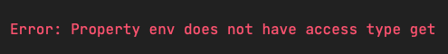

# 如何 Mock

之前一直没有跟大家讲 Jest 的 Mock，就是想让大家很体会体会 Mock 的便利性以及复杂性。如果没有真正用过它就看总结，
那么你可能会觉得：就这？

在前面一些章节里，我们都遇到了不少 Mock 的场景，比如 `window.location.href`、Http 请求、函数的 Mock 等等。
相信大家大概已经对 Mock 有大致印象了，不过还是感觉有点虚，所以这一章就来总结一下 Mock 的不同场景吧。

## 一次性 Mock

Jest 的官方文档 [在 Mock Functions 这一章](https://jestjs.io/docs/mock-functions) 大概说了说简单的 Mock 要怎么用。

### Mock 模块

像 `axios` 这样的 NPM 库，可以这样实现 Mock：

```ts
import axios from 'axios';
import Users from './users';

jest.mock('axios');

test('should fetch users', () => {
  const users = [{name: 'Bob'}];
  const resp = {data: users};
  axios.get.mockResolvedValue(resp);

  // 你也可以使用下面这样的方式：
  // axios.get.mockImplementation(() => Promise.resolve(resp))

  return Users.all().then(data => expect(data).toEqual(users));
});
```

但是这样的方法 **并 不 好 用！** 一般我们都会在项目里用 TypeScript，而 `axios.get` 是没有 `jest` 这些类型的，所以会报 `TS2339: Property 'mockResolveValues' does not exist on type '  >(url: string, config?: AxiosRequestConfig | undefined) => Promise '.`

正确的用法应该是用 `jest.spyOn` 来代替上面这种写法：

```ts
import axios from 'axios';
import Users from './users';

jest.mock('axios');

test('should fetch users', () => {
  const users = [{name: 'Bob'}];
  const resp = {data: users};

  jest.spyOn(axios, 'get').mockResolvedValue(resp);

  // 你也可以使用下面这样的方式：
  // jest.spyOn(axios, 'get').mockImplementation(() => Promise.resolve(resp))

  return Users.all().then(data => expect(data).toEqual(users));
});
``` 

如果你非要用 `axios.get.mockImplementation`，那么建议你使用 `ts-jest` 里的 [helper 函数](https://kulshekhar.github.io/ts-jest/docs/27.1/guides/test-helpers) `mocked`：

```ts
import { mocked } from 'ts-jest/utils'
import axios from 'axios';
import Users from './users';

jest.mock('axios');

test('should fetch users', () => {
  const users = [{name: 'Bob'}];
  const resp = {data: users};

  const mockedGet = mocked(axios.get); // 带上 jest 的类型提示
  mockedGet.mockResolvedValue(resp); // 含有 jest 的类型提示

  return Users.all().then(data => expect(data).toEqual(users));
});
```

> 注意：`ts-jest@28.0` 已经把 `mocked` 移除了！这个函数被放到 `jest-mock@27.4.0` 这个包里了（内置到 Jest）！

### 部分依赖

上面会把整个模块的实现都给干掉，如果只想 Mock 部分内容，官方也提供了对应的写法：

```ts
// foo-bar-baz.js
export const foo = 'foo';
export const bar = () => 'bar';
export default () => 'baz';
```

```ts
//test.js
import defaultExport, {bar, foo} from '../foo-bar-baz';

jest.mock('../foo-bar-baz', () => {
  // 真实的 foo-bar-baz 模块内容
  const originalModule = jest.requireActual('../foo-bar-baz');

  // Mock 默认导出和 foo 的内容
  return {
    __esModule: true,
    ...originalModule,
    default: jest.fn(() => 'mocked baz'),
    foo: 'mocked foo',
  };
});

test('should do a partial mock', () => {
  const defaultExportResult = defaultExport();
  expect(defaultExportResult).toBe('mocked baz');
  expect(defaultExport).toHaveBeenCalled();

  expect(foo).toBe('mocked foo');
  expect(bar()).toBe('bar');
});
```
然而 `jest.mock` 和 `jest.unmock` 是一对非常特殊的 API，它们会被提升到所有 `import` 前。**也就是说，上面这段代码看起是先 import 再 mock，而真实情况是，先 mock 了，再 import：**

```ts
// jest.mock 会被提升到所有 import 前
jest.mock('../foo-bar-baz', () => {
  // 真实的 foo-bar-baz 模块内容
  const originalModule = jest.requireActual('../foo-bar-baz');

  // Mock 默认导出和 foo 的内容
  return {
    __esModule: true,
    ...originalModule,
    default: jest.fn(() => 'mocked baz'),
    foo: 'mocked foo',
  };
});

import defaultExport, {bar, foo} from '../foo-bar-baz';

test('should do a partial mock', () => {
  const defaultExportResult = defaultExport();
  expect(defaultExportResult).toBe('mocked baz');
  expect(defaultExport).toHaveBeenCalled();

  expect(foo).toBe('mocked foo');
  expect(bar()).toBe('bar');
});
```

只有这样你从 `'../foor-bar-baz'` 拿到的内容才是真的 Mock 内容。所以，也推荐大家在用 `jest.mock` 和 `jest.unmock` 这两个 API 时最好写成第二种写法来避免理解上的歧义。

可能有同学会问：除了这两还有没有别的 API 会这样提升的呢？我搜了很多地方，大家只需要记住这两就好了。

> 这样的提升代码形为原本是通过 `babel-plugin-jest-hoist` 这个插件实现的，所以说刚开始只有 Babel 才能做这样的提升。所以你在选 Jest 的转译器时，也要留意一下这些小坑。不过目前大部分的转译工具都有这个功能了。

## 多次 Mock

官网对 Mock 的操作到上面就结束了，然而真实情况是在同一个测试文件中为了构造不同测试用例，往往要对同一个对象、函数、变量进行多次 Mock。

举个例子，我们添加一个配置文件 `src/utils/env.ts`：

```ts
// src/utils/env.ts
export const config = {
  getEnv() {
    // 很复杂的逻辑...
    return 'test'
  }
}
```

现在我们希望测试不同环境下的一些行为：

```ts
describe('环境', () => {
  it('开发环境', () => {
    // Mock config.getEnv => 'dev'
    // ...
  })

  it('正式环境', () => {
    // Mock config.getEnv => 'prod'
    // ...
  })
})
```

如果还用 `jest.mock` 的方法来做 Mock 的话，就有点不合适了，下面就来说说对这种要多次 Mock 的需求不同场景的解决方法。

### doMock

刚刚说到 `jest.mock` 会提升到整个文件最前面，这也导致我们无法再次修改 Mock 的实现。`jest` 还提供了另一个 API `jest.doMock`，它也会执行 Mock 操作，但是不会被提升，利用这个特性再加上内联 require 就可以实现多次 Mock 的效果了：

```ts
// tests/utils/env/doMock.test.ts
describe("doMock config", () => {
  beforeEach(() => {
    // 必须重置模块，否则无法再次应用 doMock 的内容
    jest.resetModules();
  })

  it('开发环境', () => {
    jest.doMock('utils/env', () => ({
      __esModule: true,
      config: {
        getEnv: () => 'dev'
      }
    }));

    const { config } = require('utils/env');

    expect(config.getEnv()).toEqual('dev');
  })

  it('正式环境', () => {
    jest.doMock('utils/env', () => ({
      __esModule: true,
      config: {
        getEnv: () => 'prod'
      }
    }));

    const { config } = require('utils/env');

    expect(config.getEnv()).toEqual('prod');
  })
});

```

> 需要注意的是：这里我们一共引用了两次 `utils/env`，因此要用 `jest.resetModules` 来重置前一次引入的模块内容。

虽然这个方法确实能用，但是太挫了。

### spyOn

对上面这种要多次 Mock 一个函数的情况，比较推荐的方法是用 `jest.spyOn`，添加 `tests/utils/env/spyOn.test.ts`：

```ts
// tests/utils/env/spyOn.test.ts
import { config } from "utils/env";

describe("spyOn config", () => {
  it('开发环境', () => {
    jest.spyOn(config, 'getEnv').mockReturnValue('dev')

    expect(config.getEnv()).toEqual('dev');
  })

  it('正式环境', () => {
    jest.spyOn(config, 'getEnv').mockReturnValue('prod')

    expect(config.getEnv()).toEqual('prod');
  })
});

```

有人看到 `jest.spyOn` 会说：这个我早就知道了。别急，我们慢慢增加难度。

### 对象属性

假如我们的 `env.ts` 中 `config` 里存不是 `getEnv` 函数，而是一个 `env` 属性：

```ts
export const configObj = {
  env: 'test'
}
```

我们希望的是对于不同用例，要修改 `config.env` 对应的属性值。而由于属性值不是函数，所以我们无法使用 `jest.spyOn` 来 Mock 了。

如果你学过阮一峰的《属性描述对象》，那么你应该还记得这一章讲到：对象属性都有自己的 `getter` 和 `setter`：

```ts
const obj = Object.defineProperty({}, 'p', {
  get: function () {
    return 'getter';
  },
  set: function (value) {
    console.log('setter: ' + value);
  }
});

obj.p // "getter"
obj.p = 123 // "setter: 123"
```

我们把 `env.ts` 的代码改成以下面 `getter` 取值方式：

```ts
export const configObj = {
  get env() {
    return 'test';
  }
}
```

当我们要获取 `config.env` 的时候，实际上相当于调用 `config.env` 的 `getter` 函数。所以当我们想 Mock 对象属性值时，
也等同于要 Mock 对象属性的 `getter` 返回值。既然要 Mock 函数了，又可以请出上一节的 `jest.spyOn` 了：

```ts
// tests/utils/env/getter.test.ts
import { configObj } from "utils/env";

describe("configObj env getter", () => {
  it('开发环境', () => {
    jest.spyOn(configObj, 'env', 'get').mockReturnValue('dev');

    expect(configObj.env).toEqual('dev');
  })

  it('正式环境', () => {
    jest.spyOn(configObj, 'env', 'get').mockReturnValue('prod');

    expect(configObj.env).toEqual('prod');
  })
});
```

虽然这么写有点怪怪的，不过也能凑合着用，我们继续看下面的问题。

### 单独导出函数

上面的例子都是直接导出一个对象，算是比较理想的情况了。假如我们的 `env.ts` 是直接导出一个函数：

```ts
// src/utils/env.ts
export const getEnv = () => 'test'
```

这下好了，我们连能够 spyOn 的对象都没了，这又该如何测呢？很简单，在导入的时候把它弄成对象不就好了么：

```ts
// tests/utils/env/getEnv.test.ts
import * as envUtils from 'utils/env';

describe("getEnv", () => {
  it('开发环境', () => {
    jest.spyOn(envUtils, 'getEnv').mockReturnValue('dev')

    expect(envUtils.getEnv()).toEqual('dev')
  })

  it('正式环境', () => {
    jest.spyOn(envUtils, 'getEnv').mockReturnValue('prod')

    expect(envUtils.getEnv()).toEqual('prod')
  })
});
```

有没有感觉开始魔幻起来了？

### 直接导出变量

我们再想另一种情况，如果不是直接导出 `getEnv` 函数，而是导出 `env` 变量：

```ts
// src/utils/env.ts
export const env = 'test';
```

聪明的同学会想到把 `import * as envUtils` 和 `spyOn env getter` 的方法：

```ts
// tests/utils/env/env.test.ts
import * as envUtils from 'utils/env';

describe("env", () => {
  it('开发环境', () => {
    // @ts-ignore
    jest.spyOn(envUtils, 'env', 'get').mockReturnValue('dev')

    expect(envUtils.env).toEqual('dev');
  })

  it('正式环境', () => {
    // @ts-ignore
    jest.spyOn(envUtils, 'env', 'get').mockReturnValue('prod')

    expect(envUtils.env).toEqual('prod');
  })
});
```

这里 TS 已经提示我们不能把 `dev` 和 `prod` 赋值给 `test` 了，没关系，我们先用 `@ts-ignore` 忽略它。硬着头皮换来的结果就是报错：



这里又为什么不能监听属性值的 `getter` 呢？这里我也搜了一下，发现 [这个 Issue: spyOn getter only works for static getters and not for instance getters](https://github.com/facebook/jest/issues/9675)。
`jest` 只能监听对象静态属性的 `getter` 而不能监听对象实例的属性，而我们这里的 `envUtils` 是对象实例。

要解决这个问题，我们可以通过强行赋值来解决它：

```ts
import * as envUtils from 'utils/env';

const originEnv = envUtils.env;

describe("env", () => {
  afterEach(() => {
    // @ts-ignore
    envUtils.env = originEnv;
  })
  
  it('开发环境', () => {
    // @ts-ignore
    envUtils.env = 'dev'

    expect(envUtils.env).toEqual('dev');
  })

  it('正式环境', () => {
    // @ts-ignore
    envUtils.env = 'prod'

    expect(envUtils.env).toEqual('prod');
  })
});
```

这里我们依然要用 `@ts-ignore` 来解决不能把 `dev` 和 `prod` 赋值给 `test` 的报错，而且我们还要把 `export const env = 'test'` 
改成 `export let env = 'test'` 才能进行赋值。

为了能解决上面这两个问题，我们可以使用前端 Mock 里最万能的方法 `Object.defineProperty`：

```ts
import * as envUtils from 'utils/env';

const originEnv = envUtils.env;

describe("env", () => {
  afterEach(() => {
    Object.defineProperty(envUtils, 'env', {
      value: originEnv,
      writable: true,
    })
  })

  it('开发环境', () => {
    Object.defineProperty(envUtils, 'env', {
      value: 'dev',
      writable: true,
    })

    expect(envUtils.env).toEqual('dev');
  })

  it('正式环境', () => {
    Object.defineProperty(envUtils, 'env', {
      value: 'prod',
      writable: true,
    })

    expect(envUtils.env).toEqual('prod');
  })
});
```

这样我们既不需要用 `@ts-ignore` 也不需要把 `const` 改成 `let` 了。**要注意的是，无论用直接赋值还是 `Object.defineProperty`，都需要在最开始记录 `env` 的值，
然后加一个 `afterEach` 在执行每个用例后又赋值回去，否则会造成用例之间的污染！**

上面就是在同一个文件，不同测试用例之间多次 Mock 的一些技巧了，个人感觉已经能覆盖 80% 的测试场景，相信能对你有所帮助。

## Object.defineProperty

相信看到上面最后一个例子的同学可能会震惊：`Object.defineProperty` 我一年都没用几次，这样做是不是不太正规呀？错了，这个 API 在前端测试的 Mock 里非常常见，
也是最万能的 Mock 方法。

比如，我们这里的 `env` 取的是 `window.env` 的全局变量时，你就只能用它来 Mock：

```ts
Object.defineProperty(window, 'env', {
  value: 'dev'
})
```

虽然这个 API 很强大，但是这个 API 会污染到别的测试用例，因此你需要在每个用例执行完后重新赋一次原来的值。而当你修改的不是模块内容，而公共的内容时，
比如 `String.split`,`Array.map` 这些 API 时，你污染的可能会是所有测试文件！因此，不得万不得已，尽量不用它，应该看看有没有更好的 Mock 方法。

## 奇行种

一路看起来，你会发现 Jest 的 Mock 方式非常 Hacky，然而我在搜索 Jest 的 Mock 技巧时，还发现了一些 [奇行种](https://github.com/magicmark/jest-how-do-i-mock-x) ，下面分享两个：

### 依赖注入

我们有时会 Mock 这样一个函数，它使用了相同文件里的另一个函数：

```ts
export function getPlanet () {
  return 'world';
}

export default function getGreeting () {
  return `hello ${getPlanet()}!`;
}
```

上面，我们希望通过 Mock `getPlanet` 的不同值来 `expect` `getGreeting` 的返回值。解决这个问题的关键思路是引入默认变量：

```ts
export function getPlanet () {
  return 'world';
}

export default function getGreeting (_getPlanet = getPlanet) {
  return `hello ${_getPlanet()}!`;
}
```

然后在写测试时，用一个外部的 `getPlanet` 来替代同文件里的 `getPlanet`：

```ts
import getGreeting from '../greeting.dependency-injection';

describe('getGreeting', () => {
  it('默认值', () => {
    expect(getGreeting()).toBe('hello world!');
  });

  it('输出 mars', () => {
    expect(getGreeting(() => 'mars')).toBe('hello mars!');
  });

  it('输出 jupiter', () => {
    expect(getGreeting(() => 'jupiter')).toBe('hello jupiter!');
  });

  it('回到默认值', () => {
    expect(getGreeting()).toBe('hello world!');
  });
});
```

### 改写文件内容

这个就更奇葩了，直接改写文件内容。一般在测 `fs` 模块相关代码时，比如清理文件内容，追加文件内容等，我们会希望某个目录下已经有对应的内容了，而不是自己创建文件。
这时你可以使用 `fs` 提供的 `__setVolumeContents` 来实现：

```ts
import cleanDirectory from '../clean-directory';
import fs, { __setVolumeContents} from 'fs';

jest.mock('fs'); // check out ../__mocks__/fs.js to see why this works!

test('cleanDirectory() wipes away contents of /foo/bar/baz with 2 files', () => {
  __setVolumeContents({
    '/foo/bar/baz/qux1.txt': 'hello',
    '/foo/bar/baz/qux2.txt': 'world',
  });

  const numFilesDeleted = cleanDirectory();

  expect(numFilesDeleted).toBe(2);
  expect(fs.readdirSync('/foo/bar/baz')).toHaveLength(0);
});

test('cleanDirectory() wipes away contents of /foo/bar/baz with 3 files', () => {
  __setVolumeContents({
    '/foo/bar/baz/one.txt': '1',
    '/foo/bar/baz/two.txt': '2',
    '/foo/bar/baz/three.txt': '3',
  });

  const numFilesDeleted = cleanDirectory();

  expect(numFilesDeleted).toBe(3);
  expect(fs.readdirSync('/foo/bar/baz')).toHaveLength(0);
});
```

不过我没有使用过这个方法，个人觉得还是写一个脚本放在 `utils` 里去自动创建需要的测试文件，而不是用这种 Hacky 的方式。

## 总结

这一章里，我们学会了一些 Mock 技巧：

* `jest.mock` 会提升到整个文件的顶端，先 Mock 再引入
* 可以用 `ts-jest` 提供的 `mocked` 函数让准备 Mock 的函数自动拥有 `jest` 类型提示，不过这个已在 `ts-jest@28.0` 中被移除，放到了 `jest` 自带的 `jest-mock` 库中
* `doMock` + 内联导入模块确实能解决修改 Mock 值的问题，但是太挫了，不推荐使用
* 使用 `spyOn` 来监听函数以及 `getter` 来修改返回值
* 使用 `Object.defineProperty` 来更改变量以及属性值，这个方法也会带来一些副作用，需要手动重置修改过的值
