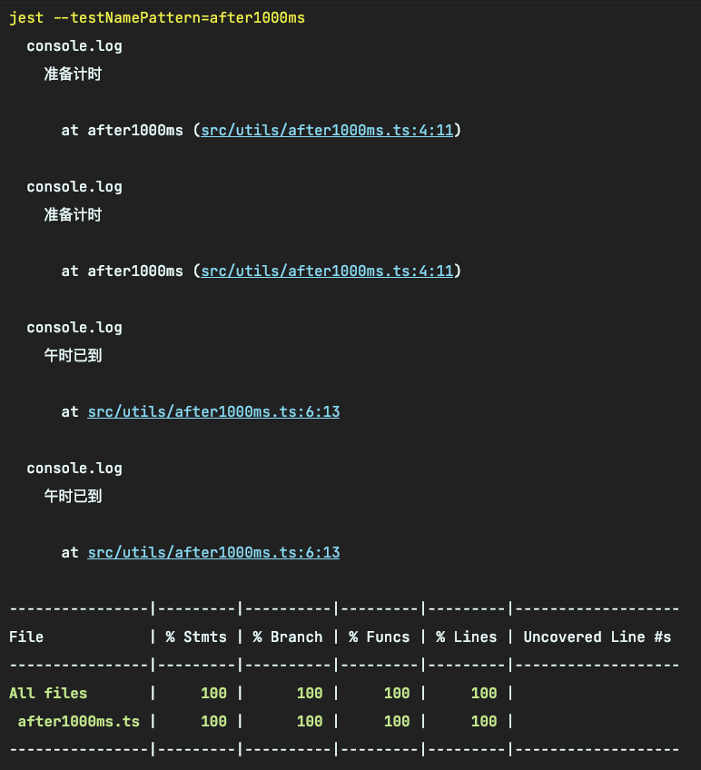
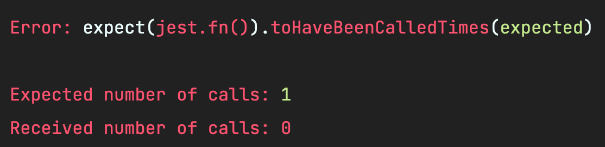
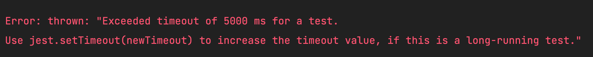
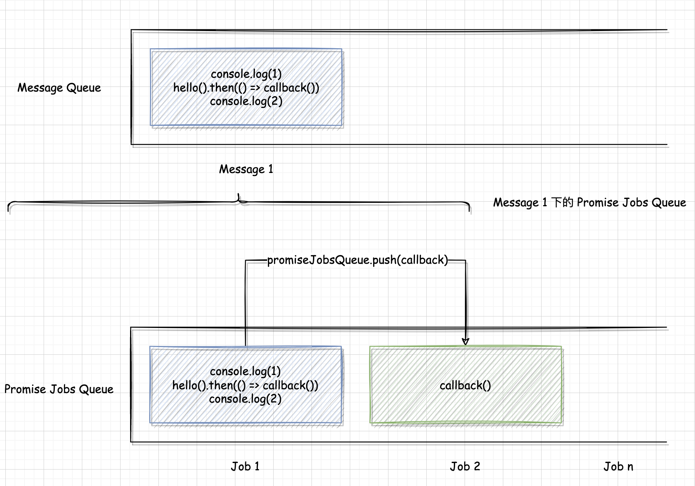

# Mock Timer

这一章来给大家讲讲关于定时器（Timer）的 Mock，做好心理准备，这会比你想象的要更复杂一点。

## 使用 Mock Timer 

先看看官网的示例：假如现在有一个函数 `src/utils/after1000ms.ts`，它的作用是在 1000ms 后执行传入的 `callback`：

```ts
// src/utils/after1000ms.ts
type AnyFunction = (...args: any[]) => any;

const after1000ms = (callback?: AnyFunction) => {
  console.log("准备计时");
  setTimeout(() => {
    console.log("午时已到");
    callback && callback();
  }, 1000);
};

export default after1000ms;
```

如果不 Mock 时间，那么我们就得写这样的用例：

```ts
// tests/utils/after1000ms.test.ts
import after1000ms from "utils/after1000ms";

describe("after1000ms", () => {
  it("可以在 1000ms 后自动执行函数", (done) => {
    after1000ms(() => {
      expect("???");
      done();
    });
  });
});
```

这样我们得死等 1000 毫秒才能跑这完这个用例，这非常不合理。现在来看看官方的解决方法，添加 `tests/utils/after1000ms.test.ts`：

```ts
// tests/utils/after1000ms.test.ts
import after1000ms from "utils/after1000ms";

describe("after1000ms", () => {
  beforeAll(() => {
    jest.useFakeTimers();
  });

  it("可以在 1000ms 后自动执行函数", () => {
    jest.spyOn(global, "setTimeout");

    after1000ms();

    expect(setTimeout).toHaveBeenCalledTimes(1);
    expect(setTimeout).toHaveBeenCalledWith(expect.any(Function), 1000);
  });
});
```

**先用 `jest.useFakeTimers` Mock 定时器，并监听 `setTimeout`。执行 `after1000ms` 后，
对 `setTimeout` 的调用做了一些断言。**

## 快进时间

上面这么测并不靠谱，因为 `after1000ms` 最重要的部分就是要看 `1000ms` 后是否真的执行了 `callback`。
**因此，对 `setTimeout` 的断言只是一种间接测试的手段。** 那该如何测函数是否被调用呢？官方给出下面的解决方案：

```ts
import after1000ms from "utils/after1000ms";

describe("after1000ms", () => {
  beforeAll(() => {
    jest.useFakeTimers();
  });

  it("可以在 1000ms 后自动执行函数", () => {
    jest.spyOn(global, "setTimeout");
    const callback = jest.fn();
    
    expect(callback).not.toHaveBeenCalled();

    after1000ms(callback);

    jest.runAllTimers();

    expect(callback).toHaveBeenCalled();
    expect(setTimeout).toHaveBeenCalledTimes(1);
    expect(setTimeout).toHaveBeenCalledWith(expect.any(Function), 1000);
  });
});
```

**在这次的测试中，我们用 `jest.fn` 生成了一个监听函数（假函数），然后马上断言这个函数是没有被调用过的。然后，
在调用 `after1000ms` 之后，用 `jest.runAllTimers` 快进时间，最后来判断 `callback` 是否只被调用了 1 次。**

## Mock Logger

中间插一个知识点，我们会发现在跑测试用例时，控制台里打印了很多冗余信息：



这在调试时可以很方便地看到结果，但是会生成很多干扰项。举个例子，如代码里有 `console.error('debug')`，那么在跑测试时就会生成很多干扰的报错信息。
**因此，我们在写测试时应该要把 Logger 给 Mock 掉。**

**第一种方法：在 `tests/jest-setup.ts` 里手动 Mock `console.xxx`：**

```ts
// tests/jest-setup.ts
jest.spyOn(console, 'log').mockReturnValue();
jest.spyOn(console, 'info').mockReturnValue();
jest.spyOn(console, 'warn').mockReturnValue();
jest.spyOn(console, 'error').mockReturnValue();
```

**第二种方法：使用 [jest-mock-console](https://www.npmjs.com/package/jest-mock-console) 这个库，在 `tests/jest-setup.ts` 里引入并使用它：**

```ts
import mockConsole from "jest-mock-console";

mockConsole()
```

两种方法效果差不多。第一种比较轻量和简单，第二种的 `jest-mock-console` 功能更强大一些，大家按自己喜好来选择就好。

## 模拟时钟的机制

虽然这个测试用例也成功了，**但实际上，我们并不清楚这里的 `Fake Timer` 到底 `Fake` 在什么地方，也不知道这段代码在时间上的调用顺序是怎样的。
我们只是很直观地认为 `执行 -> 快进 -> 断言` 是合理的，但这并没有理论依据支撑这样的现实，导致我们不太敢用 Fake Timer。**

不过，我们从上面这个用例多少能猜得出：Jest **“好像”** 用了一个数组记录 `callback`，然后在 `jest.runAllTimers` 时把数组里的 `callback` 都执行，
伪代码可能是这样的：

```ts
setTimeout(callback) // Mock 的背后 -> callbackList.push(callback)

jest.runAllTimers() // 执行 -> callbackList.forEach(callback => callback())
```

可是话说回来，`setTimeout` 本质上不也是用一个 “小本本” 记录这些 `callback`，然后在 `1000ms` 后执行的么？

**那么，我们可以提出这样一个猜想：调用 `jest.useFakeTimers` 时，`setTimeout` 并没有把 `callback` 记录到 `setTimeout` 的 “小本本” 上，而是记在了 Jest 的 “小本本” 上！** 

所以，`callback` 执行的时机也从 **“`1000ms` 后”** 变成了 **“Jest 执行 “小本本” 之时”**。**而 Jest 提供给我们的就是执行这个 "小本本" 的时机。**

好，现在我们来看官网里 `jest.useFakeTimers` 的作用介绍：**`Fake Timers` 会把以下 API 全部替换成用模拟时钟的 `jest` 实现：**

```ts
type FakeableAPI =
  | 'Date'
  | 'hrtime'
  | 'nextTick'
  | 'performance'
  | 'queueMicrotask'
  | 'requestAnimationFrame'
  | 'cancelAnimationFrame'
  | 'requestIdleCallback'
  | 'cancelIdleCallback'
  | 'setImmediate'
  | 'clearImmediate'
  | 'setInterval'
  | 'clearInterval'
  | 'setTimeout'
  | 'clearTimeout';
```

虽然我们现在搞明白了 `useFakeTimers` 的原理，但是对于 `Fake Timer` 这个概念依然有点模糊。没关系，我们来看下面这个例子，这将解开你对 `Fake Timer` 的所有谜团。

## sleep

学过 Java 的同学都知道 Java 有一个 `sleep` 方法，可以让程序睡上个几秒再继续做别的。虽然 JavaScript 没有这个函数，
但我们可以利用 `Promise` 以及 `setTimeout` 来实现类似的效果。

添加 `src/utils/sleep.ts`，在里面写一个 `sleep` 函数：

```ts
// src/utils/sleep.ts
const sleep = (ms: number) => {
  return new Promise(resolve => {
    setTimeout(resolve, ms);
  })
}

export default sleep;

// 简单点可以写成一行
// const sleep = (ms: number) => new Promise(resolve => setTimeout(resolve, ms))
```

理论上，我们会这么用：

```ts
console.log('开始'); // 准备

await sleep(1000); // 睡 1 秒

console.log('结束'); // 睡醒
```

在写测试时，我们可以写一个 `act` 内部函数来构造这样的使用场景。添加 `tests/utils/sleep.test.ts`：

```ts
// tests/utils/sleep.test.ts
import sleep from "utils/sleep";

describe('sleep', () => {
  beforeAll(() => {
    jest.useFakeTimers();
  })

  it('可以睡眠 1000ms', async () => {
    const callback = jest.fn();

    const act = async () => {
      await sleep(1000)
      callback();
    }

    act()

    expect(callback).not.toHaveBeenCalled();

    jest.runAllTimers();

    expect(callback).toHaveBeenCalledTimes(1);
  })
})
```

上面的用例很简单：在 “快进时间” 之前检查 `callback` 没有被调用，调用 `jest.runAllTimers` 后，理论上 `callback` 会被执行一次。

然而，当我们跑这个用例时会发现最后一行的 `expect(callback).toHaveBeenCalledTimes(1);` 会报错：



啊？不是说好 `jest.runAllTimers` 就把 `setTimeout` 里的 `callback` 都执行了么？最后的一行的 `callback` 应该是已经执行过一次了呀？
可能有的同学看到报错后会在 `act` 前乱加个 `await`：

```ts
await act()

expect(callback).not.toHaveBeenCalled();

jest.runAllTimers();

expect(callback).toHaveBeenCalledTimes(1);
```

这次更离谱，直接说我们测试用例超时了：



## Event Loop

如果你不能马上发现上面报错的原因，那么你还没完全理解 JavaScript 的执行顺序。要解释这两个报错，我们还得从 `Event Loop` 说起。
有别于八股文，我这里只说一个简单的版本。

### Message Queue

JavaScript 使用一个 `Message Queue` 来执行代码，**只有一个 `Message` 执行完了才能执行下一个。** 这里的 `Message` 就是我们看到的 JavaScript 代码。

**`setTimeout` 和 `setImmediate` 则是负责把 `callback` 作为一个 `Message` 添加到 `Queue` 里**，毕竟 `callback` 也是 JavaScript 代码嘛。

举个例子，对下面的代码：

```js
console.log(1)
setTimeout(() => callback(), 0)
console.log(2)
```

它的 `Message Queue` 是这样的：


### Job Queue

ES6 引入了 `Job Queues`。其中一个 `Job Queue` 就是 `Promise Job Queue`，这里的 Job 是指 **Promise resolve 后的 Job（任务）。
它们会在当前 `Message` 完成后和下一个 `Message` 开始前执行。`then(callback)` 的作用则是在 Promise resolve 后把 `callback` 作为 Job
推入 `Promise Job Queue`。**

以下面的代码为例：

```js
console.log(1)
hello().then(() => callback())
console.log(2)
```

它的 `Message Queue` 和 `Promise Job Queue` 分别是：



### async / await

`async / await` 是 `Promise` 的语法糖，`async` 会返回一个 Promise，而 `await` 则会把剩下的代码包裹在 `then` 的回调里，比如：

```ts
await hello()
console.log(1)

// 等同于
hello().then(() => {
  console.log(1)
})
```

### 小结

小结一下：

1. 对于一份要执行的 JavaScript 代码，它本身就是一个 `Message`，会立马推入 `Message Queue` 中来消费。
2. 如果这段代码里有 `setTimeout`，那么会把它回调函数里的 JavaScript 代码片段作为新的 `Message` 再推入 `Message Queue` 中进行等待。
3. 如果这段代码里有 `Promise`，当 resolve 后会把 `then` 里的代码片段作为 `Job` 推入 `Promise Job Queue` 中等待。
4. 当这段代码（第1步）执行完后，推出这个 `Message`，执行 `Promise Job Queue` 的内容（`then` 的回调），然后再来执行下一个 `Message`（`setTimeout` 的回调）。

所以，别人经常说的“先执行完同步代码再执行异步代码”，原理就是 `Event Loop` 的执行机制。现在，来考考你下面这段代码的执行顺序是怎样的：

```js
test('执行顺序', async () => {
  console.log('1');
  setTimeout(() => { console.log('6'); }, 0);
  const promise = new Promise(resolve => {
    console.log('2');
    resolve();
  }).then(() => {
    console.log('4');
  });
  console.log('3');
  await promise;
  console.log('5');
});
```

正确答案：`1, 2, 3, 4, 5, 6`，解释一下：

| 顺序                                                             | Message Queue         | Promise Jobs Queue |
|----------------------------------------------------------------|-----------------------|--------------------|
| 同步代码，打印 `1`                                                    | `[test('执行顺序')]`      | `[]`               |
| `new Promise(fn)` 里的 `fn` 也为同步代码，打印 `2`                        | `[test('执行顺序')]`      | `[]`               |
| `setTimeout` 把 `6` 作为 `Message` 推入 `Message Queue`             | `[test('执行顺序'), '6']` | `[]`               | 
| Promise 中有 `resolve`，且有 `then`，把 `push('4')` 作为 Job 推到 Promise | `[test('执行顺序'), '6']` | `['4']`            |
| 同步代码，打印 `3`                                                    | `[test('执行顺序'), '6']` | `['4']`            |
| 有 `await`，把 `5` 推入 `Promise Job Queue`                         | `[test('执行顺序'), '6']` | `['4', '5']`       |
| 清算 `Promise Job Queue`，打印 `4`, `5`                             | `['6']`               | `[]`               |
| 开始 `Message Queue` 的下一个 `Message`，打印 `6`                       | `[]`                  | `[]`               |

**从这里我们也可以推测出，Jest 的 `Fake Timer` 也是一个 `Message Queue`，只不过它会在 `setTimeout` 时把 `Message` 记录到它自己的 `Message Queue` 中。
这样一来，我们就可以在同步执行代码中用 `jest.runAllTimers` 来决定是否要一次清算所有 `Message`（回调）。**

## 测试报错的原因

现在回过头来看看我们的测试用例。

### 调用 `callback` 次数为 0 的问题

对于第一种写法，我们使用了语法糖 `await`，也可以写成这样：

```ts
// tests/utils/sleep.test.ts
describe('sleep', () => {
  beforeAll(() => {
    jest.useFakeTimers();
  })

  it('可以睡眠 1000ms', async () => {
    const callback = jest.fn();

    sleep(1000).then(() => {
      callback()
    })

    expect(callback).not.toHaveBeenCalled();

    jest.runAllTimers();

    expect(callback).toHaveBeenCalledTimes(1);
  })
})
```

这里用了 `Fake Timer`，所以 `setTimeout` 会替换成了 Jest 的 `setTimeout`。执行 `setTimeout(callback, 1000)` 之后，
Jest 的 `Message Queue` 里会推入一个当前 Promise 的 `resolve` 函数。

走到第一个 `expect` 通过，再走到 `jest.runAllTimers` ，**此时会同步地执行 Jest 中的 `Message Queue` 所有回调，也即同步执行了 `resolve`。**
由于 `sleep` 这个 Promise 被 resolved 了，会把 `then` 的回调放到 `Promise Job Queue` 里。

**但是此时，当前 `Message` 还没走完，会走到最后一个 `expect`。** 由于我们的 `callback` 一直在 `Promise Job Queue` 里，
所以当执行最后一个 `expect` 时，`callback` 一直没有被调用。最终测试用例不通过。

### 超时问题

对于第二种写法：

```ts
// tests/utils/sleep.test.ts
import sleep from "utils/sleep";

describe('sleep', () => {
  beforeAll(() => {
    jest.useFakeTimers();
  })

  it('可以睡眠 1000ms', async () => {
    const callback = jest.fn();

    const act = async () => {
      await sleep(1000)
      callback();
    }

    await act()

    expect(callback).not.toHaveBeenCalled();

    jest.runAllTimers();

    expect(callback).toHaveBeenCalledTimes(1);
  })
})
```

`setTimeout` 把 `resolve` 函数推入 Jest 的 `Message Queue` 这一步依然不变。

但这里的 `await act()` 会把后面的所有代码（测试用例代码以及 `jest-cli` 的结束代码）都包裹在 `then` 的回调里。
**而由于在 `sleep` 里的 `resolve` 一直没调用，`act` 后面的所有代码代码一直没放到 `Promise Job Queue` 里，
导致最后结束测试的 `jest-cli` 代码也一直无法执行。最终测试用例超时失败。**

## 解决方法

要解决这两个问题也很简单，我们只需要在第一种写法里，把最后一个 `expect` 放到 `Promise Job Queue` 最后就可以了：

```ts
// tests/utils/sleep.ts
import sleep from "utils/sleep";

describe("sleep", () => {
  it("可以在 1s 后再执行", async () => {
    jest.useFakeTimers();

    const act = async (callback: () => void) => {
      await sleep(1000);
      callback();
    };

    const mockCallback = jest.fn();

    const promise = act(mockCallback);

    // mockCallback 还未调用
    expect(mockCallback).not.toBeCalled();

    // 清算 Jest Message Queue 的回调，其中会执行 setTimeout 里的 resolve 函数
    jest.runAllTimers();

    // 执行 callback 内容
    await promise;

    // mockCallback 已调用
    expect(mockCallback).toBeCalled();
    expect(mockCallback).toHaveBeenCalledTimes(1);
  });
});
```

## 总结

在这一章中，我们学会了使用 `Fake Timer` 来处理 `setTimeout` 的定时操作，不需要等 1000ms 再做断言，能更快结束测试。

通过学习 `Event Loop` 机制，**我们了解到 Jest 的 `Fake Timer` 就是把 `setTimeout` 等延时 API 的回调都收集到自己的 `Queue` 里，
你可以随时随地清算这个 `Queue`，而不需要等 XX 毫秒后再一个个执行。**

虽然这一章的业务代码并不多，但是如果不了解 Jest 的 `Fake Timer` 原理以及 `Event Loop` 运行机制，我们很容易在做时间相关函数的测试时栽跟头。
所以说，背背八股文没什么不好的。 **工作上不只是造螺丝，还可能造火箭。**

## 参考资料

[Jest: Timer and Promise don't work well. (setTimeout and async function)](https://stackoverflow.com/questions/52177631/jest-timer-and-promise-dont-work-well-settimeout-and-async-function)
