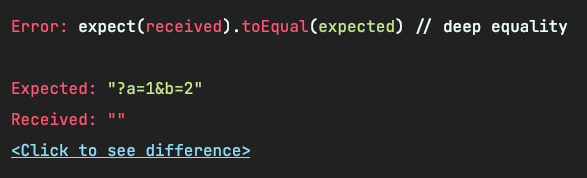

# Mock 网页地址

上一章说到可以配置 `testEnvironment: 'jsdom'` 来创造一个 Node.js 的浏览器环境，然后在这个环境下跑测试。但，真的只配一个 `jsdom` 就解决所有问题了么？

**当然不是！其中最难搞的场景就是修改网页路径。**

## 例子

我们这里依然用一个例子来说明，添加 `src/utils/getSearchObj.ts`：

```ts
// src/utils/getSearchObj.ts
const getSearchObj = () => {
  // ?a=1&b=2
  const { search } = window.location;

  // a=1&b=2
  const searchStr = search.slice(1);

  // ['a=1', 'b=2']
  const pairs = searchStr.split("&");

  // { 'a': '1' }
  const searchObj: Record<string, string> = {};

  pairs.forEach((pair) => {
    // [a, 1]
    const [key, value] = pair.split("=");
    searchObj[key] = value;
  });

  return searchObj;
};

export default getSearchObj;
```

这个函数的作用是把网页地址中的 **查询参数字符串** 转换为 **对象**，比如：

```js
window.location.href = 'https://www.baidu.com?a=1&b=2'

const result = getSearchObj()

// result = {
//   a: '1',
//   b: '2',
// }
```

::: tip
`getSearchObj()` 只是一个示例方法，如果你想把 **查询字符串** 转换为 **对象**，可以用下面更现代且更安全的方法(注意浏览器兼容性)：
```ts
const getSearchObj = () => {
    return Object.fromEntries(
        new URLSearchParams(window.location.search).entries(),
    );
};

export default getSearchObj;
```
:::

现在我们就按这个例子来给 `getSearchObj` 写测试，添加 `tests/utils/getSearchObj.test.ts`：

```ts
// tests/utils/getSearchObj.test.ts
import getSearchObj from "utils/getSearchObj";

describe("getSearchObj", () => {
  it("可以获取当前网址的查询参数对象", () => {
    window.location.href = "https://www.baidu.com?a=1&b=2";

    expect(window.location.search).toEqual("?a=1&b=2");
    expect(getSearchObj()).toEqual({
      a: "1",
      b: "2",
    });
  });

  it("空参数返回空", () => {
    window.location.href = "https://www.baidu.com";

    expect(window.location.search).toEqual("");
    expect(getSearchObj()).toEqual({});
  });
});
```

然后你会得到这个报错：



## 扩展测试环境

为什么明明设置了新的 `window.location.href`，还是为空的呢？根据 [这个 StackOverflow 贴子](https://stackoverflow.com/questions/33921415/set-location-hash-and-location-href-with-jsdom) ，
你必须要用下面代码才能修改当前的（假的）网页地址：

```ts
import { JSDOM } from 'jsdom';

const jsdom = new JSDOM();

// ...
jsdom.reconfigure({
  url: 'https://www.baidu.com?a=1&b=2',
});
// ...
```

**那么问题来了：这里的 `jsdom` 是从哪里来的呢？** 如果你尝试用 `global.jsdom` 或者 `global.JSDOM` 来生成 `jsdom`，然后调用 `jsdom.reconfigure`，你会得到一个大大的 `undefined`。
因为 Jest 并没有把 [jsdom](https://www.npmjs.com/package/jsdom) NPM 的内容暴露出来，导致你无法使用 `jsdom.reconfigure`。详见 [这个 Github Issue](https://github.com/facebook/jest/issues/890) 。

有的同学会留意到：刚刚在 Mock `localStorage` 的时候，我们用到了 `Object.defineProperty`，那我们能否用下面的方法来试图 Hack 掉网页地址呢？

```ts
Object.defineProperty(window.location, 'href', {
  writable: true,
  value: 'https://www.baidu.com?a=1&b=2'
});
```

**答案是：不行！** 你会得到这样的报错：`Error: Not implemented: navigation (except hash changes)`，毕竟是 Hack 手法，并不推荐，[详见这个 Issue](https://github.com/facebook/jest/issues/890#issuecomment-501260238) 。

::: tip
经 Issue 区提醒，也可以尝试以下方法：
```ts
// tests/utils/getSearchObj.test.ts
describe('getSearchObj', () => {
  it('可以获取当前网址的查询参数对象', () => {
    Object.defineProperty(window, 'location', {
      writable: true,
      value: { href: 'https://google.com?a=1&b=2', search: '?a=1&b=2' },
    });
    expect(window.location.search).toEqual('?a=1&b=2');
    expect(getSearchObj()).toEqual({
      a: '1',
      b: '2',
    });
  });
  it('空参数返回空', () => {
    Object.defineProperty(window, 'location', {
      writable: true,
      value: { href: 'https://google.com', search: '' },
    });
    expect(window.location.search).toEqual('');
    expect(getSearchObj()).toEqual({});
  });
});
```

这个方法与上面不同点在于：Mock `window.location` 对象，而不是 `window.location.href` 属性。但缺点是不仅要在 `href` 写查询参数，还要在 `search` 再写一遍查询参数。
:::


终于，有人受不了，不就 `jest` 没有把 `jsdom` 对象丢到全局么？把 `jsdom` 测试环境做个扩展不就好了：

```ts
const JSDOMEnvironment = require("jest-environment-jsdom");

module.exports = class JSDOMEnvironmentGlobal extends JSDOMEnvironment {
  constructor(config, options) {
    super(config, options);

    // 放到全局
    this.global.jsdom = this.dom;
  }

  teardown() {
    this.global.jsdom = null;

    return super.teardown();
  }
};
```

上面这段代码继承了原来的 `JSDOMEnvironment` 的测试环境，在构造器里把 `jsdom` 绑定到了全局对象上。

当然，我们不用自己写这段代码，有人已经把它变成了一个 NPM 包了：[jest-environment-jsdom-global](https://github.com/simon360/jest-environment-jsdom-global) 。
我们来安装一下：

```shell
npm i -D jest-environment-jsdom-global@3.0.0
```

然后在 `jest.config.js` 里使用这个魔改后的测试环境：

```js
// jest.config.js
module.exports = {
  testEnvironment: 'jest-environment-jsdom-global'
};
```

再把测试改成如下：

```ts
// tests/utils/getSearchObj.test.ts
import getSearchObj from "utils/getSearchObj";

describe("getSearchObj", () => {
  it("可以获取当前网址的查询参数对象", () => {
    // 使用全局暴露出来的 jsdom
    global.jsdom.reconfigure({
      url: "https://www.baidu.com?a=1&b=2",
    });

    expect(window.location.search).toEqual("?a=1&b=2");
    expect(getSearchObj()).toEqual({
      a: "1",
      b: "2",
    });
  });

  it("空参数返回空", () => {
    // 使用全局暴露出来的 jsdom
    global.jsdom.reconfigure({
      url: "https://www.baidu.com",
    });

    expect(window.location.search).toEqual("");
    expect(getSearchObj()).toEqual({});
  });
});
```

由于 `global` 类型声明中没有声明 `jsdom` 属性，导致下面的报错：


所以，我们还要添加一个全局声明文件 `src/types/global.d.ts`：

```ts
// src/types/global.d.ts
declare namespace globalThis {
  var jsdom: any;
}
```

::: danger
上面属性声明一定要用 `var`！否则不生效！
:::

配置好后，测试文件就不会报错了。

## Mock Location

上面的做法不是很优雅：我们只是想改个地址而已，又要改环境，又要写全局类型定义，而且还是个 `any` 类型，动静有点大。
有没有动静小一点的方法呢？ **有，我们可以用 [jest-location-mock](https://www.npmjs.com/package/jest-location-mock) 。**

::: tip
要实现这样的小功能，你永远可以相信 [NPM](https://www.npmjs.com/) 😘。
:::

这个包就是专门用于修改网页地址的。缺点是我们只能用它 Mock 的 3 个 API：

* `window.location.assign`
* `reload`
* `replace`

不过，我们这个场景是完全够用的。先来安装一波：

```shell
npm i -D jest-location-mock@1.0.9
```

然后在 setup 文件 `tests/jest-setup.ts` 里全局引入一下：

```js
// jest-setup.ts
// 使用 Jest 的 Spy 和扩展 expect 来 Mock `window.location`
import "jest-location-mock";
```

再把 `jest.config.js` 里的 `testEnvironment` 改回来：

```js
// jest.config.js
module.exports = {
  testEnvironment: 'jsdom' // 改回来
};
```

最后，把测试代码改为：

```ts
// tests/utils/getSearchObj.test.ts
import getSearchObj from "utils/getSearchObj";

describe("getSearchObj", () => {
  it("可以获取当前网址的查询参数对象", () => {
    window.location.assign('https://www.baidu.com?a=1&b=2');

    expect(window.location.search).toEqual("?a=1&b=2");
    expect(getSearchObj()).toEqual({
      a: "1",
      b: "2",
    });
  });

  it("空参数返回空", () => {
    window.location.assign('https://www.baidu.com');

    expect(window.location.search).toEqual("");
    expect(getSearchObj()).toEqual({});
  });
});
```

再执行一下测试用例，会发现测试通过。

## 总结

在这一章里，我们学到了两种修改测试中网页地址的方法：

**第一种方法使用 [jest-environment-jsdom-global](https://github.com/simon360/jest-environment-jsdom-global) 。** 这种方法会在 `global` 全局对象挂一个 `jsdom`，
通过 `jsdom` 的 `reconfigure` API 来修改 JSDOM 环境的 `url`。

**第二种方法使用 [jest-location-mock](https://www.npmjs.com/package/jest-location-mock) 。** 这种方法会监听 `window.location.assign`，通过它来改变网页地址。

两种方法任君选择，我会比较推荐使用 `jest-location-mock`，简单一点。

**“如何在测试中修改网页地址”** 是前端测试中非常常见的一个问题，在中文社区里几乎好的回答，很多还停留在 `Object.defineProperty`。然而，这个方法早在 `jest@21.x` 的版本就用不了了。

所以，我觉得有必要开一章告诉大家正确修改 `window.location.href` 的方法。同时在这一章里，也给大家展示了如何通过继承 `jsdom` 环境来扩展成自己想要的测试环境。
