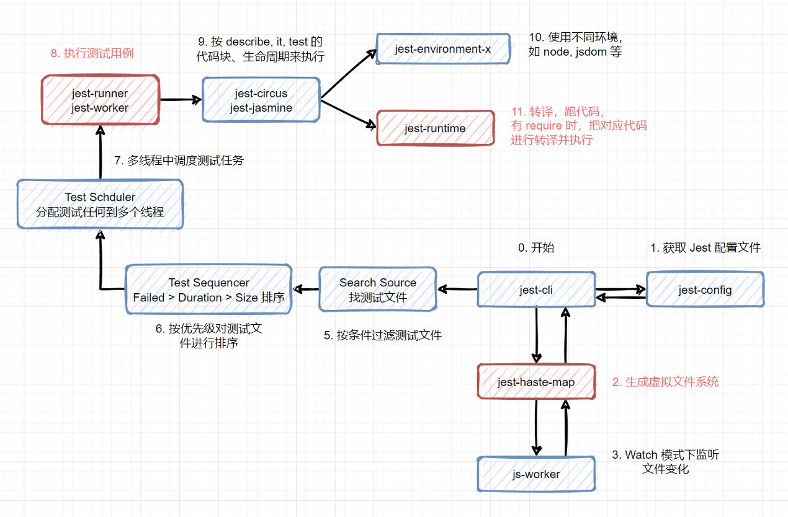
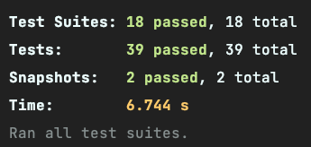
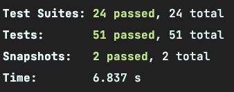
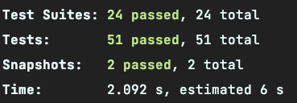

# Jest 性能优化

非常感谢能看到最后，这本指南也快到尾声了。

你应该也积累了不少测试文件，会发现跑这十几个测试用例变得越来越慢了，动辄一两分钟。理论上，单测和集成测试不应该跑这么慢的。所以，这一章来聊聊 **Jest 的性能优化**。

## Jest 架构

要解决 Jest 的性能问题，我们得了解一下 Jest 是怎么运行的。之前偶然在 [YouTube](https://www.youtube.com/watch?v=3YDiloj8_d0&t=2s) 上看到 Jest 作者非常详细地讲述整个 Jest 执行流程，在这里我只做了一下简单地搬运。英语比较好的同学可以直接看视频进行了解。



从上图可以看到，最影响 Jest 性能的有 3 个地方：

1. **使用 `jest-haste-map` 生成虚拟文件系统**
2. **多线程执行测试任务**
3. **转译 JavaScript 代码**

## 虚拟文件系统

如果要在热更新时修改文件，脚手架都要遍历一次项目文件，非常损耗性能。特别在一些文件特别多的巨石应用中，电脑分分钟就卡得动不了。

为了解决这个问题，Facebook 团队就想到了一个方法 —— **虚拟文件系统**。原理很简单：**在第一次启动时遍历整个项目，把文件存储成 Map 的形式，
之后文件做了改动，那么只需增量地修改这个 Map 就可以了。** 他们把这个工具命名为 **Haste Map**，中文翻译可以理解为快速生成 Map 的东西（这名字真的不好）。

**这种思路不仅可以用于热更新场景，还能应用在所有监听文件改动的场景，其中一种就是 `npx jest --watch` 这个场景。**


因此，上面图中刚开始时，Jest 就用 `jest-haste-map` 生成了一次虚拟文件系统，这样后续的过滤、搜索文件就非常快速了。这也是为什么执行第一个测试用例时速度比较慢的原因。
这一步的性能我们无法优化。

## 多线程

Jest 还有一个非常强大的功能，利用 Node.js 的 Worker 开启多个线程来执行测试用例。对于一些大型项目（几千个测试用例）来说，这能提升不少效率。

但线程不是越多越好，每开一个线程都需要额外的开销。如果不做任何配置，那么 Jest 默认最大的 Worker 数是 `CPU 数 - 1`。其中的 `1` 用于运行 `jest-cli`，
剩下的都拿来执行测试用例。由于之前我们一直没有对 `maxWorkers` 进行配置，所以默认会用最多的 Worker，执行这么几十个简单的测试会非常慢。

通常来说，单个测试用例速度应该要做到非常快的，尽量不写一些耗时的操作，比如不要加 `setTimeout`，`n` 个 `for` 循环等。
所以，理论上，测试数量不多的情况下单线程就足够了。这里我们可以把 `jest.config.js` 配置改为用单线程：

```js
// jest.config.js
module.exports = {
  maxWorkers: 1
}
```

在流水线中，Jest 也推荐使用单线程来跑单测和集成测试：`jest --runInBand`，其中 `runInBand` 和 `maxWorkers: 1` 效果是一样的。

::: warning
**我试了一下在以前的 Intel Mac 里单线程的速度比多线程快了一倍，而 M1 的 Mac 上则是相反，多线程比单线程快。所以，还是要自己的机器的情况来决定使用多少个 Worker。**
:::

**M1 Macbook Pro，单线程：**


**M1 Macbook Pro，多线程：**



## 文件转译

最后一个性能优化点就是转译速度（图中第 11 步）。需要注意的是 Jest 是会边执行测试用例边转译 JavaScript。


有的同学会问了：既然 Jest 刚开始遍历项目来生成虚拟文件系统，为什么不顺便把转译的工作做了呢？**当然是因为慢了。** 
首先，对于很多业务项目来说，测试并不会很多。可能就测几个 `utils` 下的函数，那如果把项目的文件都转译一次，会把很多没用到测试的业务代码也转译。

这些同学还不甘心：那可以在拿到测试文件后，分析出这个文件的依赖，再来做转译（在第 7，8 步）了，然后再执行测试呀？理论上是可以的。但是，
**JavaScript 引入模块的方式实在是太多了**，先不说 `amd`, `es6`, `umd`, `cmd`, `abcd` 这么多的引入方式了，单单这个就很难处理：

```ts
// ├── index.ts
// └── instances
//     ├── api1.ts
//     ├── api2.ts
//     ├── api3.ts
//     └── api4.ts

// index.ts
const services = (require as any).context('./instances', false, /.*/)

console.log(services); // api1, api2, api3, api4
```

**所以说，通过文件找依赖的方式不是很可靠，有太多不确定因素，最终 Jest 还是选择 “执行到那个文件再做转译” 的方法。**

原理说完了，下面来看看怎么提高转译效率。在前面的章节里，我们说到当今 JavaScript 的转译器有很多种，不仅可以用 `tsc` 和 `babel` 来转，
还能用别的语言写的转译器 `swc` 以及 `esbuild` 来转。

如果想用 `esbuild` 做转译，可以看 [esbuild-jest](https://github.com/aelbore/esbuild-jest) 这个库。这里我用 [@swc/jest](https://swc.rs/docs/usage/jest) 做例子，
先安装依赖：

```shell
npm i -D @swc/core@1.2.165 @swc/jest@0.2.20
```

然后在 `jest.config.js` 里添加：

```js
module.exports = {
  // 不用 ts-jest
  // preset: "ts-jest", 

  transform: {
    // 使用 swc 转译 JavaScript 和 TypeScrit
    "^.+\\.(t|j)sx?$": ["@swc/jest"],
    // 静态资源 stub 转译
    ".+\\.(css|styl|less|sass|scss|png|jpg|ttf|woff|woff2)$":
      "jest-transform-stub",
  },
}
```

大功告成，配置非常简单，我们来看看使用 `ts-jest` 以及 `@swc/jest` 两者的对比。

**ts-jest：**



**@swc/jest：**



## 总结

这一章我们学到了 Jest 的整体架构，其中有 3 个地方比较耗性能：

1. **生成虚拟文件系统。** 在执行第一个测试会很慢
2. **多线程。** 生成新线程耗费的资源，不过，不同机器的效果会不一致
3. **文件转译。** Jest 会在执行到该文件再对它进行转译

解决的方法有：
1. 无解，有条件的话拆解项目吧
2. 具体情况具体分析，要看机器的执行情况，多线程快就用多线程，单线程快就用单线程
3. 使用 `esbuild-jest`、 `@swc/jest` 等其它高效的转译工具来做转译
