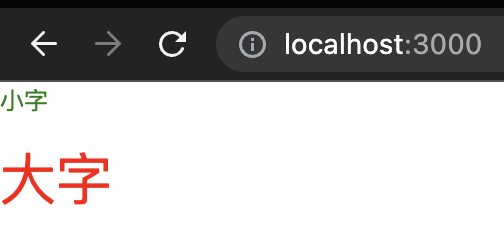

# 快照测试

上一章我们在项目中引入了 React，现在我们开始 React App 的开发和测试吧。说到组件或者 UI 的测试，很多人都会第一时间想到 **快照测试**。
虽然他们听过这个名字，但是快照测试的一些细节是不太清楚的，所以这章来聊聊快照测试。

## Title 组件

我们在 `src/components/Title.tsx` 写一个 `Title` 组件：

```tsx
import React, { CSSProperties, FC } from "react";

interface Props {
  type: "large" | "small";
  title: string;
}

const largeStyle: CSSProperties = {
  fontSize: "2em",
  color: "red",
};

const smallStyle: CSSProperties = {
  fontSize: "0.5em",
  color: "green",
};

const styleMapper: Record<"small" | "large", CSSProperties> = {
  small: smallStyle,
  large: largeStyle,
};

const Title: FC<Props> = (props) => {
  const { title, type } = props;

  return <p style={styleMapper[type]}>{title}</p>;
};

export default Title;
```

然后在 `src/App.tsx` 里使用这个组件：

```tsx
import React from 'react';
import Title from "components/Title";

const App = () => {
  return (
    <div>
      <section>
        <Title type="small" title="小字" />
        <Title type="large" title="大字" />
      </section>
    </div>
  )
}

export default App;
```

会在页面上看到效果：



## 第一个快照

在写测试前，我们要安装一下 React 的测试库，或许你听说过很多测试 React 的库和框架，这里我只推荐 [React Testing Library](https://testing-library.com/docs/react-testing-library/intro/) ：

```shell
npm i -D @testing-library/react@12.1.4
```

现在我们在 `tests/components/Title.test.tsx` 添加一个快照测试：

```tsx
import React from "react";
import { render } from "@testing-library/react";
import Title from "components/Title";

describe("Title", () => {
  it("可以正确渲染大字", () => {
    const { baseElement } = render(<Title type="large" title="大字" />);
    expect(baseElement).toMatchSnapshot();
  });

  it("可以正确渲染小字", () => {
    const { baseElement } = render(<Title type="small" title="小字" />);
    expect(baseElement).toMatchSnapshot();
  });
});
```

执行测试后，会发现在 `tests/components/` 下多了一个 `Title.test.tsx.snap` 文件，打开来看看：

```js
// Jest Snapshot v1, https://goo.gl/fbAQLP

exports[`Title 可以正确渲染大字 1`] = `
<body>
  <div>
    <p
      style="font-size: 2em; color: red;"
    >
      大字
    </p>
  </div>
</body>
`;

exports[`Title 可以正确渲染小字 1`] = `
<body>
  <div>
    <p
      style="font-size: 0.5em; color: green;"
    >
      小字
    </p>
  </div>
</body>
`;
```

## 什么是快照测试

要讲什么是快照测试，我们先来说说为什么要有快照测试，毕竟快照测试原来是不存在的，是在 `jest@14` 才引入的。

当我们在对组件测试时，使用 `jest` 和 `React Testing Library` 都能完成基础的 `props` 、交互以及功能测试，但是组件毕竟是组件，是有 HTML 结构的。
如果不对比一下 HTML 结构，很难说服自己组件没问题。但是这就引来了一个问题了：**要怎么对比 HTML 结构？**

最简单的方法就是把这个组件的 `HTML` 打印出来，拷贝到一个 `xxx.txt` 文件里，然后在下次跑用例时，把当前组件的 `HTML` 字符串和 `xxx.txt` 
文件里的内容对比一下不就知道 DOM 结构有没有被修改了么？ **这就是快照测试的基本理念，即先保存一份副本文件，
下次测试时把当前输出和上次副本文件对比就知道是否此次重构是否破坏了某些东西。**

只不过 `jest` 的快照测试有如下特色：
1. 自动创建把输出内容写到 `.snap` 快照文件，下次自动对比
2. 输出的快照文件阅读友好，更容易看懂
3. 当在做 `diff` 对比时，`jest` 能高亮差异点，而且对比信息更容易阅读

所以，我们来看看上面这个例子：

1. 在执行第一次用例时，把 `baseElement` 的结构记录到 `Title.test.tsx.snap`
2. 下次再执行这个用例时，会对比当前 `baseElement` DOM 快照以及上一次的 `Title.test.tsx.snap`

快照测试成功了就没什么好说的，就通过呗。我们要更关注失败的情况，如果失败则有两种可能：

1. **你在重构 `Title` 组件但是不想改变 DOM。** 快照测试失败了，说明代码有 Bug 导致 DOM 结构变了
2. **你在写 `Title` 新功能** 。新功能会本身会改变 DOM 结构，所以你要用 `jest --updateSnapshot` 来更新加了新功能的组件快照

这就是快照测试......了么？当然不是！哦，我是说做法就是这么简单，但是思路上并不简单。

## 缺陷

上面这么做测试，你会感觉很不安，不靠谱。我搜罗了网上很多资料，这里稍微总结一下。

### 避免大快照

现在 `Title` 比较简单，所以看起来还可以，但真实业务中动辄就十几个标签，还带上很多属性，这个快照文件会变得非常巨大。

对于这个问题，我们能做的就是避免大快照，不要无脑地记录整个组件的快照，特别是有别的 UI 组件参与其中的时候：

```tsx
const Title: FC<Props> = (props) => {
  const { title, type } = props;

  return (
    <Row style={styleMapper[type]}>
      <Col>
        第一个 Col
      </Col>
      <Col>
        <div>{title}</div>
      </Col>
    </Row>
  )
};
```

*注：这里引用 `antd` 的 `Col` 和 `Row` 然后跑测试时，会报：`[TypeError: window.matchMedia is not a function]`。
这是因为 JSDOM 没有实现 `window.matchMedia`，所以你要在 `jest-setup.ts` 里添加 Mock：*

```js
// tests/jest-setup.ts
// 详情：https://jestjs.io/docs/manual-mocks#mocking-methods-which-are-not-implemented-in-jsdom
Object.defineProperty(window, 'matchMedia', {
  writable: true,
  value: jest.fn().mockImplementation(query => ({
    matches: false,
    media: query,
    onchange: null,
    addListener: jest.fn(), // deprecated
    removeListener: jest.fn(), // deprecated
    addEventListener: jest.fn(),
    removeEventListener: jest.fn(),
    dispatchEvent: jest.fn(),
  })),
});
```

那么你的快照会变成这样：

```js
exports[`Title 可以正确渲染大字 1`] = `
<body>
  <div>
    <div
      class="ant-row"
      style="font-size: 2em; color: red;"
    >
      <div
        class="ant-col"
      >
        第一个 Col
      </div>
      <div
        class="ant-col"
      >
        <div>
          大字
        </div>
      </div>
    </div>
  </div>
</body>
`;
```

揉杂了 `antd` 的 DOM 结构后，这个快照变得非常难读。所以，我们应该只记录第二个 `Col` 的内容就好：

```tsx
describe("Title", () => {
  it("可以正确渲染大字", () => {
    const { getByText } = render(<Title type="large" title="大字" />);
    const content = getByText('大字');
    expect(content).toMatchSnapshot();
  });

  it("可以正确渲染小字", () => {
    const { getByText } = render(<Title type="small" title="小字" />);
    const content = getByText('小字');
    expect(content).toMatchSnapshot();
  });
});
```

那么跑 `npx jest --updateSnapshot` 后，会生成如下快照：

```js
exports[`Title 可以正确渲染大字 1`] = `
<div>
  大字
</div>
`;

exports[`Title 可以正确渲染小字 1`] = `
<div>
  小字
</div>
`;
```

这样的快照则更容易让人看懂。**但快照并不是越小越好，你可能会想：这样的快照还不如我写  `expect(content.children).toEqual('大字')` 来得简单。**

**所以说，对于那种输出很难构造（比如非法字符等等）而且不方便用简单断言 `expect` API 时，快照测试是一个很好的解决方法。
这也是为什么组件 DOM 结构适合做快照，因为 DOM 结构有大量的大于、小于、引号这些字符。如果都用 `expect` 来断言，用例会写得非常痛苦。
只不过需要注意的是：不要把无关的 DOM 也记录到快照里，这无法让人看懂。**

### 假错误

假如现在我们把测试用例改成这样：

```tsx
describe("Title", () => {
  it("可以正确渲染大字", () => {
    const { getByText } = render(<Title type="large" title="我是一个大帅哥" />);
    const content = getByText('大字');
    expect(content).toMatchSnapshot();
  });
});
```

马上就得到这样的报错：


但其实我们业务代码并没有问题，只是文案改了一下，这就是测试中的 "假错误"。虽然普通的单测、集成测试里也可能出现假错误，但是快照测试出现假错误的概率会更高，
这也导致我们不怎么信任快照测试。

特别是在一些快照非常大，组件非常复杂的情况下，别的开发者改了个东西很容易导致一大片快照报错，基于人性的弱点，他们是不会太有耐心找快照测试失败的原因的。
再加上更新快照的成本很低，只要加个 `--updateSnapshot` 就可以了，所以人们在面对快照测试不通过时，往往选择更新快照而不是是否 DOM 真的改变了。

这些因素造成的最终结果就是：**大家不再信任快照测试。** 因此，你也会发现市面上很多前端测试的总结以及文章都很做快照测试。其中很大原因是快照测试本身比较脆弱，
以及野马脱缰式的滥用。

## 快照的扩展

上面说到由于快照测试的一些特性，舍不得在做组件测试时非常有用。不过，我发现这让人很容易把快照测试直接等于组件的 UI 测试，或者说快照测试是只用来测组件的。
而事实上并不是！

我们重新来看看快照测试的做法：**第一次把输出内容存到 `.snap` 文件，之后把每次输出内容和 `.snap` 文件内容进行比较。** `jest` 的快照不仅仅能记录 DOM 结构，
 **还能记录 **一切能被序列化 的内容，比如纯文本、JSON、XML 等等。**

举个例子：

```ts
// getUserById.ts
const getUserById = async (id: string) => {
  return request.get('user', {
    params: { id }
  })
}

// getUserById.test.ts
describe('getUserById', () => {
  it('可以获取 userId == 1 的用户', async () => {
    const result = await getUserById('1')
    expect(result).toEqual({
      // 非常巨大的一个 JSON 返回...
    })
  })
});
```

这个例子我们测试了 `getUserById` 的结果。在平常业务开发中，HTTP 请求返回的结果都是比较大的，而且很多时候还会有后端一些冗余的数据，所以这里我们也可以给当前的 `response` 拍一张快照，
下次再用这张快照对比就好了：

```ts
// getUserById.ts
const getUserById = async (id: string) => {
  return request.get('user', {
    params: { id }
  })
}

// getUserById.test.ts
describe('getUserById', () => {
  it('可以获取 userId == 1 的用户', async () => {
    const result = await getUserById('1')
    expect(result).toMatchSnapshot();
  })
});
```

**快照测试还适用于那些完全没有测试的项目。** 想想看，如果你要把测试引入一个项目，你会遇到什么？很大概率会遇到上面的 `getUserById` 的情况。
虽然 `getUserById` 没有测试，但是它早已在线上验证通过了。假如此时你要写 `expect(result).toEqual({...})` 的断言来验证返回，你会发现你根本不知道 `{...}` 里要写什么。

你会怎么做？要是我，我就先不写断言，先跑一次测试，把 `result` 打印出来，再把打印内容贴到 `{...}`，这样的过程是不是似曾相识？这不就是上面的快照测试么？
**所以，快照测试非常适合在线上跑了很久的老项目，不仅能验证组件，还能验证函数返回、接口结果等。**

## 总结

这一章我们学会了 **快照测试**。快照测试的思想很简单：

* 先执行一次测试，把输出结果记录到 `.snap` 文件，以后每次测试都会把输出结果和 `.snap` 文件做对比
* 快照失败有两种可能：
  * 业务代码变更后导致输出结果和以前记录的 `.snap` 不一致，说明业务代码有问题，要排查 Bug
  * 业务代码有更新导致输出结果和以前记录的 `.snap` 不一致，新增功能导致新的输出，合理情况，要用 `npx jest --updateSnapshot` 更新当前的 `.snap` 文件

不过现实中这两种失败情况并不好区分，更多的情况是你既在重构又要加新需求，这就是为什么快照测试会出现 "假错误"。而如果开发者还一直滥用以及生成大快照，
那么最终的结果是没有人再相信快照测试，每次遇到快照测试失败时，大家都不愿意探究失败的原因，而喜欢无脑地更新快照。

要避免这样的情况，需要做好两点：

* **生成小快照。** 只取重要的部分来生成快照，必须保证快照是能让你看懂的
* **合理使用快照。** 快照测试不是只为组件测试服务，同样组件测试也不一定要包含快照测试。快照能存放一切可序列化的内容。

根据上面两点，还能总结出快照测试的适用场景：

* **组件 DOM 结构的对比**
* **在线上跑了很久的老项目**
* **大块数据结果的对比**

从这一章可以看出，做测试没有我们想得那么简单：干就完了。测试更多时候需要我们做取舍，以及找到合适的测试策略。这在下一章会有更明显的体验，下在让我们进入下一章的学习吧。
