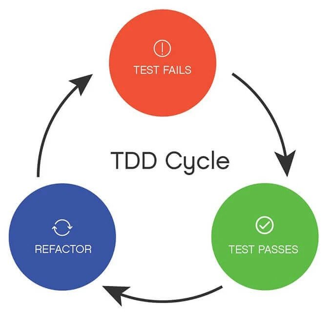

# 测试驱动开发

在上一章，我用一个例子给大家解释了 `getSearchObj` 函数的作用：

```ts
window.location.href = 'https://www.baidu.com?a=1&b=2'

const result = getSearchObj()

// result = {
//   a: '1',
//   b: '2',
// }
```

如果大家没有写过 `getSearchObj`，可能会在实现的时候打很多个 `console.log` 来调试它：

```ts
const getSearchObj = () => {
  // ?a=1&b=2
  const { search } = window.location;

  const searchStr = search.slice(1);
  console.log('searchStr', searchStr) // a=1&b=2
  
  const pairs = searchStr.split("&"); 
  console.log('pairs', pairs); // ['a=1', 'b=2']

  const searchObj: Record<string, string> = {}; 
  console.log('searchObj', searchObj); // { 'a': '1' }

  pairs.forEach((pair) => {
    
    const [key, value] = pair.split("=");
    console.log('key', key, 'value', value) //  [a, 1]
    searchObj[key] = value;
  });

  return searchObj;
};

console.log('result', getSearchObj());
```

这些 `log` 不仅难看，而且 `log` 出来后我们还要把他们删掉。而且，这样最多只能测到一两种 Case，不能覆盖到所有边界情况。为了能手动执行它，
我们还得一遍遍刷新网页，然后肉眼找茬。

::: tip
**这里的 `log` 操作，也可以看成是一种手动测试：`执行 -> 用眼睛看结果`。** 
:::

那为什么不把上这些操作自动化，用程序代替手工呢？**这就是 TDD（Test Driven Development）测试驱动开发。**

## 原理

TDD 是一种非常好用的开发模式，做法很简单：**先写测试，再写业务代码，当所有测试用例都通过后，你的业务代码也就实现完了**，图解：



* 🚨 红色部分：在你还没添加新功能前先写的一个测试。然后你会得到一个失败的测试用例（看到 “红色” 的报错信息）。
* ✅ 绿色部分：不断添加业务代码来让测试通过（看到 “绿色” 成功通过信息）。
* 🌀 重构部分：再回过头看审视自己的代码，把它重构成可读性和维护性更高的代码（这一步最爽的点就是在重构时，你有一个测试会告诉你有没有搞崩原有逻辑）。
* 🔁 重复：这就是个循环，反正 😉 一直走下去，直到写完这个功能

**TDD 站在开发者的视角测试一个功能的组成模块比如函数或方法是否预期，而 BDD（Behavior Driven Development）行为驱动测试，与之不同是站在用户的角度描述测试用例。更多可阅读 [Understanding the Differences Between BDD & TDD](https://cucumber.io/blog/bdd/bdd-vs-tdd/#:~:text=BDD%20is%20designed%20to%20test,pieces%20of%20functionality%20in%20isolation.)。**

我们之前写的 `sum`, `storage` 以及 `getSearchObj` 属于 TDD 开发模式。

## 适用场景

或许有些人不太能接受先写测试再写业务这种模式，觉得先花那么多时候在测试上不值得。这其实是一种误解，他们并没有搞清楚 TDD 要解决的问题以及它的适用场景。
TDD 有以下适用场景：

**第一种：写纯函数场景。** 前面几章写的 `sum` 和 `getSearchObj` 就是纯函数。不管里面的逻辑简单还是复杂，我们都很容易就能想到这些函数的输入输出，
所以写这些函数的测试用例是最简单的。先在写业务前先定义好 90% 使用场景的输入输出，Jest 就能快速帮我们验证业务实现是否正确，而不用频繁地 `console.log`。

**第二种：修 Bug 场景。** 这对没有任何测试的项目非常实用。当遇到 Bug 时，先写一个测试用例来复现问题，然后通过这个用例来调试业务代码。用例通过后，
业务代码也自然被修复了。

**第三种：UI 交互场景。** 在开始写页面逻辑时，把 HTTP 请求给 Mock 掉（在后面会讲到），先用测试模拟真实用户的使用路径，然后再实现业务逻辑。
当测试用例通过后，说明需求的主逻辑也是能走通的。

可以看到上面这些场景中没有说到 “代码质量”，“覆盖率”，“异常情况”，**所以，TDD 的主要作用不是保证代码质量，
而是给开发者创造一个更友好的开发环境，在这基础上保障了代码的主逻辑。**

从上面场景，我们可以得出结论：**TDD 比较适合那些实现复杂，但输入输出很明确的场景。** 因此，TDD 也被广泛用到工具函数，数据转换函数，
以及后端的接口测试。

## 用例文档化

**TDD 的另一个好处（应该说是所有测试用例的好处）就是用例文档化。**

还记得上一章我是怎么给大家说清楚 `getSearchObj` 的含义和作用么？我嫌啰嗦，直接套用了一个例子来让你明白什么叫 **“把网页地址中的查询参数字符串转换为对象”**：

```ts
window.location.href = 'https://www.baidu.com?a=1&b=2'

const result = getSearchObj()

// result = {
//   a: '1',
//   b: '2',
// }
```

如果这时又有一个人问我这个函数是用来干嘛的，我又得说一遍这个例子。那为什么不把它记录到代码里呢？**当使用 TDD 时，
提前写的测试用例都会提交到代码仓库里，可以作为一份简单的使用文档。** 这样的好处有：

**降低上手难度。** 相信大家在使用别人的模块时，经常会听到：“你看 XXX 文件就知道 YYY 怎么用了”。但这个 XXX 文件往往有非常多的依赖和干扰项，
很难弄清楚最简单的使用方法。**而测试用例（特别是单测）通常只测其中一个使用场景，所以它们会记录着最简单、朴素的 Use Case。使用者只需看测试用例，
即可知道如何上手。**

**用例正确性。** 接口文档化是做后端（Node 端）非常重要的一步，有的人写在腾讯文档，有的人喜欢存在 Postman，以方便调试。但这些用例有个致命的缺点：
接口发生变更时，很难及时更新对应的示例。测试用例正好可以解决这个问题，**由于测试用例必须全部通过才能 Push 代码，所以我们永远不用担心用例的过期问题。**

## 实战

言归正传，我们来简单使用一下 TDD。假如现在有一个需求：*把给定对象转换成查询参数字符串。*

首先，我们添加 `tests/utils/objToSearchStr.test.ts`，用测试用例来描述这个需求：

```ts
import objToSearchStr from "utils/objToSearchStr";

describe("objToSearchStr", () => {
  it("可以将对象转化成查询参数字符串", () => {
    expect(
      objToSearchStr({
        a: "1",
        b: "2",
      })
    ).toEqual("a=1&b=2");
  });
});
```

然后，再来添加 `src/utils/objToSearchStr.ts`，边看业务输入输出边实现代码逻辑：

```ts
const objToSearchStr = (obj: Record<string, string | number>) => {
  // ['a=1', 'b=2']
  const strPairs: string[] = [];

  Object.entries(obj).forEach((keyValue) => {
    const [key, value] = keyValue; // [a, 1]
    const pair = key + "=" + String(value); // a=1
    strPairs.push(pair);
  }, []);

  // a=1&b=2
  return strPairs.join("&");
};

export default objToSearchStr;
```

在执行测试时，我们还能用 IDE 的调试器来做断点调试，绝对比疯狂打 `console.log` 来得高效。

## 总结

在这一章里，我们学到 TDD 和 BDD 两种开发模式：
* TDD：先测试，之后补充业务
* BDD：先写业务，再对重要部分补充测试

我们还了解到TDD 的使用场景和要解决的问题、以及用例文档化的好处。最后，我们用 TDD 的开发模式来实现了 `objToSearchStr` 这个函数。
