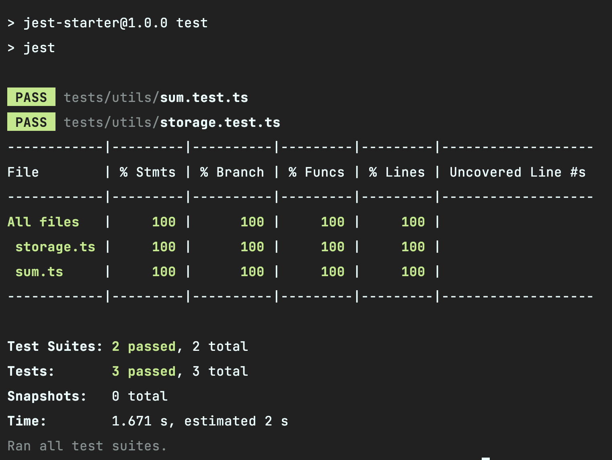

# 测试环境

刚刚的 `sum` 实在是太简单了，根本无难度。这一章我们来搞点有难度。

在很多时候，我们前端的代码往往只在浏览器里运行，经常要用到浏览器的 API。我之前就封装过一个 `storage` 文件，
通过指定 `type = 'indexedDB' | 'cookoie' | 'localStorage'` 来切换存储的方式，而且还可以生成自定义的 `key`，防止全局污染。

**相信大家也见过不少这种和浏览器强绑定的工具文件，那我们该如何测它们呢？**

## 例子

对刚说的 `storage` 做下简化，我们只对 `localStorage` 进行封装，一共有 `set` 和 `get` 两个函数。添加 `src/utils/storage.ts`：

```ts
// src/utils/storage.ts
const KEY_NAME = "my-app-";

const set = (key: string, value: string) => {
  localStorage.setItem(KEY_NAME + key, value);
};

const get = (key: string) => {
  return localStorage.getItem(KEY_NAME + key);
};

const storage = {
  get,
  set,
};

export default storage;
```

然后在 `tests/utils/storage.test.ts` 添加这个文件的测试用例：

```js
// tests/utils/storage.test.ts
import storage from "utils/storage";

describe("storage", () => {
  it("可以缓存值", () => {
    storage.set("newKey", "hello");
    expect(localStorage.getItem("my-app-newKey")).toEqual("hello");
  });

  it("可以设置值", () => {
    localStorage.setItem("my-app-newKye", "hello");
    expect(storage.get("newKey")).toEqual("hello");
  });
});
```

由于 Node.js 环境并没有 `localStorage`，所以你会得到这样的报错：


## 全局 Mock

既然没有 `localStorage`，那我们可以给它 Mock 一个！首先添加 `tests/jest-setup.ts` 文件，然后放置 `localStorage` 的 Mock 实现：

```ts
// tests/jest-setup.ts
Object.defineProperty(global, 'localStorage', {
  value: {
    store: {} as Record<string, string>,
    setItem(key: string, value: string) {
      this.store[key] = value;
    },
    getItem(key: string, value: string) {
      return this.store[key];
    },
    removeItem(key: string) {
      delete this.store[key];
    },
    clear() {
      this.store = {}
    }
  }
})
```

::: tip
得益于刚刚配置的 TypeScript，这里的 setup 文件也可以写成 `.ts` 了！
:::

然后在 `jest.config.js` 里添加 `setupFilesAfterEnv` 配置：

```js
module.exports = {
  setupFilesAfterEnv: ['./tests/jest-setup.ts'],
};
```

::: danger
**注意：一定要使用 `setupFilesAfterEnv` 而不是 `setupFiles`！**
:::

**设置了之后，`jest-setup.ts` 会在每个测试文件执行前先执行一次。** 相当于每执行一次测试，都会在全局添加一次 `localStorage` 的 Mock 实现。
现在再来执行一次 `npm run test`，会发现执行成功：


## jsdom 测试环境

但是这样有点傻，因为我们不可能把浏览器里所有的 API 都 Mock 一遍，而且不可能做到 100% 还原所有功能。因此，`jest` 提供了 `testEnvironment` 配置：

```js
module.exports = {
  testEnvironment: "jsdom",
}
```

添加 `jsdom` 测试环境后，全局会自动拥有完整的浏览器标准 API。**原理是使用了 [jsdom](https://github.com/jsdom/jsdom) 。
这个库用 JS 实现了一套 Node.js 环境下的 Web 标准 API。** 由于 Jest 的测试文件也是 Node.js 环境下执行的，所以 Jest 用这个库充当了浏览器环境的 Mock 实现。

现在清空 `jest-setup.ts` 里的代码，直接 `npm run test` 也会发现测试成功：



::: warning
**请不要把 `jest-setup.ts` 删掉，后面还大有用处！**
:::

那 `testEnvironment` 除了 `jsdom` 还有没有别的呢？有，不过一般都只是 `jsdom` 的扩展环境，在下一章会讲到，那现在我们就进入下一章的学习吧~

## 总结

这一章里，我们学到了 `setupFilesAfterEnv`，它可以指定一个文件，在每执行一个测试文件前都会跑一遍里面的代码。在这个 setup 文件中，
可以放置全局的 Mock 实现，以及一些初始化操作。

为了方便测试浏览器环境下的代码，我们可以配置 `testEnvironment: 'jsdom'` 来创建一个 Node.js 的浏览器环境。这样我们就不用每个 API 都 Mock 一次了。
